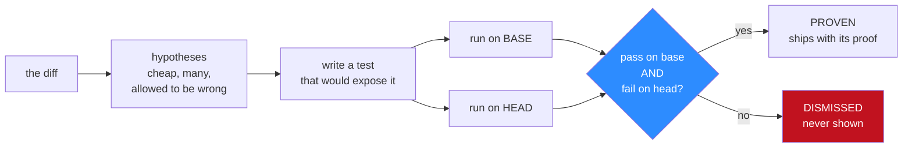

# TRIBUNAL

**Half of the best AI code reviewer's comments are noise. Not because the model is weak —
because nothing stops it from guessing.**

TRIBUNAL is a code reviewer that is **forbidden to speak without evidence**. Every finding it
publishes carries an executable artefact: a test that **passes on the base commit and fails on
the head commit**, produced in a sealed container, committed next to the comment.

A hypothesis that cannot produce that artefact is not softened into "low confidence." It is
destroyed, and you never see it.

Precision stops being a property of the model. It becomes a property of the architecture.

The model is still allowed to hallucinate. It just cannot publish.

---

## The number this exists because of

The [Martian Code Review Bench](https://www.coderabbit.ai/blog/coderabbit-tops-martian-code-review-benchmark)
(March 2026) evaluated AI code reviewers across roughly 300,000 real pull requests, scoring on
whether a developer actually acted on each comment. CodeRabbit **won**:

| | Precision | Recall | F1 |
|---|---|---|---|
| CodeRabbit, 1st of the field | **49.2%** | 53.5% | **51.2%** |

First place means **one comment in two, from the best tool in the category, is noise.**

That is not a scandal. It is an honest measurement of a hard problem, and CodeRabbit earned the
win. But it does say something about the axis everyone is pushing on. Better models, deeper repo
context and larger windows have moved this number a few points. TRIBUNAL's argument is that
precision was never on the model-quality axis at all:

> The question is not *how well can the reviewer judge?*
> It is *what is the reviewer permitted to say?*

---

## How a finding earns the right to exist

| Stage | What enforces it |
|---|---|
| A hypothesis is formed | An LLM. Cheap, plural, and **allowed to be wrong** — this stage has no authority |
| It becomes a falsifiable claim | The model must write a **test**, not a paragraph. A claim it cannot instrument dies here |
| The claim is put to the question | The test runs in an ephemeral container, `--network none`, no repository credentials |
| It must implicate *this diff* | **The differential rule**: pass on base, fail on head. Nothing else counts |
| It must be real, not lucky | Re-run N times. Non-deterministic means quarantined, not published |
| A human checks it | Not by reading an argument — by running the committed test themselves |

The fourth row is load-bearing. **Pass-on-base / fail-on-head** kills two entirely different
failure modes with one rule: findings the model invented, and findings that are real but
pre-existing — the reviewer blaming your pull request for something it did not cause. That
second class is a large share of real-world review noise, and almost nothing in the category
checks for it.

---

## The part we did not hide

**CodeRabbit already has a sandbox, and it is good.** Their review agent writes shell in what
they call *"tools in jail"* — `cat`, `grep`, `ast-grep`, `curl` — and their
[agentic code validation](https://www.coderabbit.ai/blog/how-coderabbits-agentic-code-validation-helps-with-code-reviews)
work describes verification agents that execute and stress-test code. Any pitch claiming AI
reviewers "only read the diff" is simply wrong, and this project does not make it.

The difference is not capability. It is constitutional:

> CodeRabbit's sandbox is an *optional aid* to a reviewer that can still speak without it.
> TRIBUNAL makes the jail *mandatory*.
> They built the jail. This asks what the product looks like when nothing leaves it unproven.

That trade has a price, stated here rather than discovered by a skeptical reader:

- **Recall goes down.** A gate that rejects unproven findings rejects some true ones. The exact
  cost is the headline measurement in [06 — Experiments](docs/06-experiments.md), reported
  whichever way it lands.
- **A whole class of good review is impossible here.** Naming, structure, readability, "this
  will be painful to maintain in a year" — all valuable, all unprovable by execution, all
  outside anything TRIBUNAL can ever say. It is not a replacement for a reviewer. It is a
  different organ.
- **Proof costs seconds and containers**, where an opinion costs one token. Cost per proven
  finding is a first-class metric here, not a footnote.

---

## The screenshot nobody else would ship

The dashboard's main panel is **the graveyard**: every hypothesis that was executed and killed,
sitting beside the handful that survived.

Every product in this category hides that pile. Showing it is the point. It is the visible,
countable evidence of noise that *did not reach a human*, and it is the only honest way to
display a precision claim.

---

## What you see in the demo

| Do this | Watch this |
|---|---|
| Point it at a pull request | Twenty hypotheses appear in seconds, none of them trusted |
| Watch the adjudication panel | Containers spawn, tests run, hypotheses die in real time |
| Open a proven finding | The failing test, the base run, the head run, the whole transcript |
| Open the graveyard | The thirty-odd comments you were never shown, and exactly why each died |
| Run it against a repo with **no** injected bugs | The correct output is silence. Any comment is a failure and is scored as one |
| Flip the proof gate off | The same reviewer, ungated. The comment count explodes. That is the control |

---

## Where the ground truth comes from

You cannot measure precision without knowing the right answer, and scraping one needs accounts,
crawlers and permission. TRIBUNAL generates its own: a **Saboteur** agent injects known,
runtime-observable bugs into a real open-source Python repository, and the reviewer hunts them
having never seen the answer key.

The isolation is not a promise in a prompt. The reviewer's containers run `--network none`, and
the ground truth is never mounted into its filesystem. It cannot cheat because it cannot reach.

See [03 — The gym](docs/03-gym.md).

---

## Status

**Design complete, implementation not started.** Every document below is written to be built
from directly; build order and milestone exit criteria are in
[07 — Roadmap](docs/07-roadmap.md).

Requires Docker and an OpenAI-compatible API key. The design targets a **$3 total token
budget**: a hard-capped ledger refuses calls past the limit, and every model call is cached to
disk by prompt hash, so re-runs and demo recordings cost nothing. The key lives only in
server-side processes — no `NEXT_PUBLIC_*` variable carries a credential.

---

## Documents

| Doc | What's in it |
|---|---|
| [01 — Concept](docs/01-concept.md) | Why "a better reader" is the wrong axis, and what a burden of proof buys instead |
| [02 — Burden of proof](docs/02-burden-of-proof.md) | The evidence protocol, the differential rule, verdicts, flake control. The core document |
| [03 — The gym](docs/03-gym.md) | The Saboteur, the mutation taxonomy, and how the answer key stays hidden |
| [04 — Agents](docs/04-agents.md) | The LangGraph graph, the container model, and surviving on $3 |
| [05 — UI](docs/05-ui.md) | The scoreboard, the graveyard, and the proof-replay terminal |
| [06 — Experiments](docs/06-experiments.md) | What the proof gate costs in recall, measured before the code exists |
| [07 — Roadmap](docs/07-roadmap.md) | M0–M7, each independently demoable. The weekend stops cleanly at M3 |
