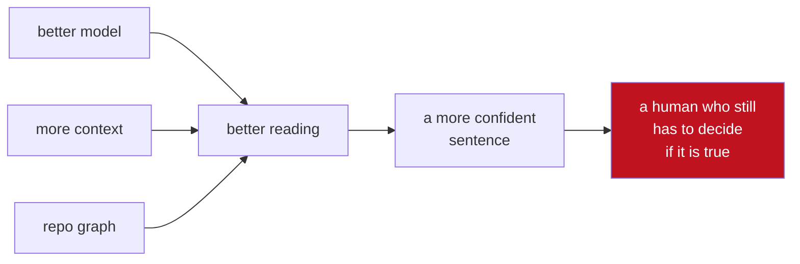
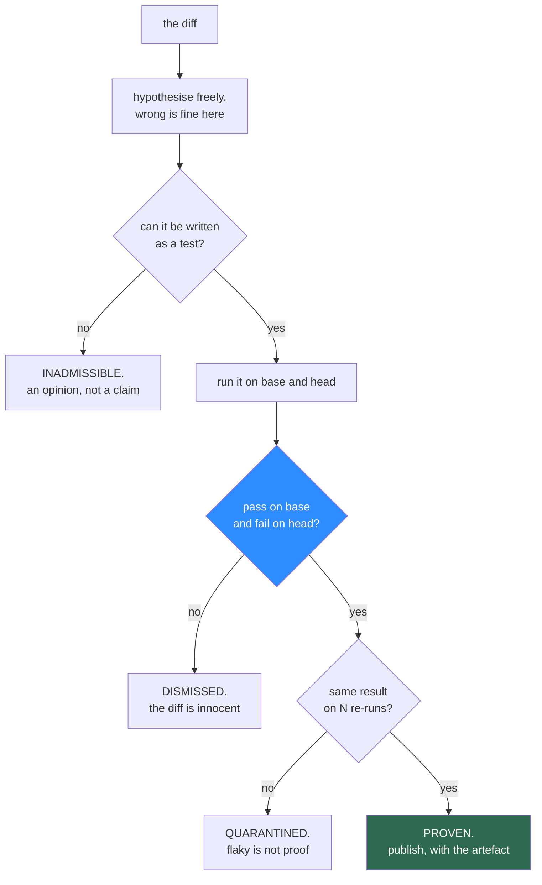

# 01 — Concept

## The assumption nobody questions

Every AI code reviewer is built on the same premise: **review gets better when the reader gets
better.**

So the field competes on reading. Bigger context windows. Whole-repository embeddings. Call
graphs, AST queries, learned team conventions, memory of past reviews. Each of these is real
engineering and each of them helps. And the resulting comment is still, structurally, the same
object it was two years ago:

> A confident sentence, produced by a system with no obligation to be right, addressed to a human
> whose only recourse is to read it and decide.

The reviewer bears no cost for being wrong. The developer bears all of it.

## What the scoreboard actually says

The [Martian Code Review Bench](https://www.coderabbit.ai/blog/coderabbit-tops-martian-code-review-benchmark)
(March 2026) is the first independent evaluation the category has had. It scored AI reviewers
across roughly 300,000 real pull requests on the only metric that matters commercially — did a
developer *act* on the comment.

CodeRabbit came first: **49.2% precision, 53.5% recall, 51.2% F1.**

Read that as a winner's score and it is impressive. Read it as a category score and it is
sobering. **The best tool in the field is wrong about half the time it opens its mouth**, and
the tools behind it are worse. Greptile's deeper structural context buys higher bug detection at
a materially higher false-positive rate. Everyone is trading the same two quantities against
each other.

Every arrow on the left is genuine progress. None of them changes the shape of the thing on the
right.

## Why confidence scores are not the answer

The standard mitigation is to have the model rate its own certainty and suppress everything
below a threshold.

This does not remove noise. It **sorts** it. A model that is wrong half the time is also
miscalibrated about *which* half — that is the same failure expressed twice. Raise the threshold
and you lose true findings faster than false ones, because the findings a model is least sure
about are disproportionately the subtle ones worth having.

Confidence is the reviewer grading its own homework. The output is still an assertion.

## What TRIBUNAL does instead

**Move the burden of proof onto the reviewer.**

TRIBUNAL is allowed to think anything. It is not allowed to *say* anything it cannot demonstrate.
Concretely, every published finding must arrive with a test that:

1. **passes** when run against the base commit, and
2. **fails** when run against the head commit,

executed in a sealed container, recorded, and committed next to the comment.

The hypothesis stage is deliberately cheap and deliberately unreliable. **It has no authority.**
Making the model better at that stage raises recall; it cannot raise the false-positive rate,
because the gate does not care how confident the model was.

That is the whole idea: **precision becomes an architectural invariant rather than a model
metric.** You do not tune it. You cannot regress it by swapping models.

## The rule that does the heavy lifting

Of everything above, one line matters most:

> **Pass on base. Fail on head.**

It looks like a detail. It eliminates two unrelated failure modes at once.

**Hallucinated findings** die because an invented bug produces a test that fails on both commits
or neither.

**Pre-existing findings** die too — and this is the part usually missed. A large share of
real-world review noise is not fabricated. It is *true and irrelevant*: the reviewer notices a
genuine weakness in code the pull request merely touched, and reports it as though the author
introduced it. The comment is correct and the developer still resents it, because it is not
their bug and not this change's problem. A differential test cannot express that mistake. If the
base commit fails the same way, the diff is innocent, and the finding is dropped.

No shipping reviewer in the category applies this test. It is close to free, and it is the
single highest-yield rule in the design. [02 — Burden of proof](02-burden-of-proof.md) specifies
it in full.

## The constraint, stated up front

The tempting pitch for this project is *"other AI reviewers just read the diff; mine actually
runs the code."*

**That claim is false, and anyone at CodeRabbit would know it in one sentence.**

CodeRabbit's review agent operates inside a sandbox, writing shell rather than calling typed
tools — `cat`, `grep`, `ast-grep`, `curl`, the GitHub CLI — in an arrangement they describe as
*"tools in jail."* Their published work on
[agentic code validation](https://www.coderabbit.ai/blog/how-coderabbits-agentic-code-validation-helps-with-code-reviews)
goes further, describing verification agents that execute and stress-test code. They also run
50-plus linters and security analysers in sandboxed environments as a matter of course.

Execution is not the differentiator. **Obligation** is:

> In every shipping reviewer, execution is an *optional aid* to a system that can speak without
> it. In TRIBUNAL, execution is the *only channel through which speech is possible*.

CodeRabbit built the jail. This project asks what the product becomes when nothing gets out of
it unproven. That is a smaller claim than "we execute and they don't", and unlike that one, it
survives contact with someone who works there.

## Where LangGraph belongs

Stated plainly, because overclaiming here loses any reader who knows the tool:

> **LangGraph runs the trial. It does not decide the verdict.**

The reviewer is a bounded state machine over a diff — fan out into hypotheses, fan back in over
verdicts, respect a hard budget, checkpoint so a crashed run resumes instead of re-paying for
tokens. That is exactly LangGraph's job and there is nothing clever about using it here.

What is emphatically *not* in the graph is the adjudication. A verdict is produced by a process
exiting non-zero inside a container. No node votes on it, no chain reflects on it, no model is
asked whether the evidence is convincing. The moment a model is allowed to judge the proof, the
whole guarantee collapses back into an opinion with extra steps.

[04 — Agents](04-agents.md) draws the graph.

## Why the CodeRabbit team should care

- It attacks **the exact number they lead on**. They won Martian at 49.2% precision. This is a
  design where the equivalent number is not a model property, and the interesting question is
  what it costs in recall — measured, in [06](06-experiments.md), and published either way.
- The **differential rule is close to free and nobody ships it.** Pass-on-base / fail-on-head is
  a small amount of harness code that removes a real and specific category of complaint. It is
  the sort of idea that is obvious only after someone writes it down.
- It is **the natural extension of infrastructure they already own.** They built the jail, the
  shell-writing agent and the sandboxed tool fleet. This is a reading of that investment they
  have not published: make the jail mandatory and precision stops being something you tune.
- **The graveyard is a new product surface.** Showing users the noise that was suppressed is
  something no reviewer in the category does, and it converts a precision claim from marketing
  into a countable artefact on screen.
- It **measures itself without a customer.** The gym generates its own ground truth from a real
  repository, so the design can be evaluated by anyone with Docker and no accounts at all.

## The honest limits

Written here rather than left for a skeptical reader to find:

- **Recall will drop, and possibly a lot.** Every finding that is real but not expressible as a
  short deterministic test is lost. That includes concurrency bugs, anything needing production
  data, and anything whose damage is measured in months. [06](06-experiments.md) measures the
  gap against an ungated control and reports it whichever way it falls.
- **An entire species of good review is structurally impossible.** Naming, cohesion,
  readability, API taste, "this will hurt in a year" — real value, none of it provable by
  execution, none of it something TRIBUNAL can ever emit. This is not a general reviewer and
  should never be sold as one.
- **Proof is expensive.** An opinion costs one token; a proof costs a container, a dependency
  install and several seconds. Cost per proven finding is tracked as a headline metric because
  it is the most likely reason this design fails commercially.
- **A test that fails is not always a bug.** A diff may deliberately change behaviour, and a
  differential test will call that a regression. Intentional behaviour changes are the design's
  main false-positive channel and the one place a human still has to arbitrate — see the
  intent-check discussion in [02](02-burden-of-proof.md).
- **The gym's bugs are not real bugs.** Injected mutations are drawn from a taxonomy someone
  chose, which makes the recall number a measurement against *that* distribution and not against
  the wild. [03](03-gym.md) says exactly how the distribution is built and where it is
  unrepresentative.

## Non-goals

- **Replacing CodeRabbit, or any general reviewer.** It cannot comment on most of what review is
  for. The realistic shape of this idea is a gate that runs *alongside* one, not instead of it.
- **Beating anyone on recall.** The design deliberately trades recall away. A comparison that
  ranks on recall is measuring the wrong thing and this project will lose it.
- **Auto-fixing.** TRIBUNAL proves; it does not patch. A system that both diagnoses and treats
  has an incentive to diagnose, and that is precisely the incentive being removed here.
- **A confidence score.** There is no probability attached to a finding. A finding is proven or
  it does not exist, and shipping a number alongside it would reintroduce the thing the design
  exists to delete.
