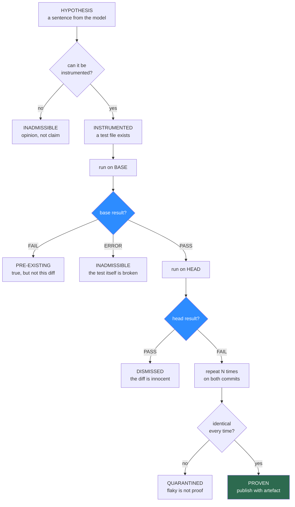

# 02 — Burden of proof

This is the core document. Everything else in TRIBUNAL exists to serve the protocol described
here.

The protocol answers one question: **under what conditions is a code review comment allowed to
reach a human?**

## The standard is not "convincing"

A conventional reviewer, human or machine, publishes when it is *persuaded*. TRIBUNAL publishes
when it has an artefact, and being persuaded counts for nothing.

An admissible finding consists of four things, all of them files on disk:

| Part | What it is | Who produced it |
|---|---|---|
| **The claim** | One sentence naming what breaks and where | The model |
| **The instrument** | A standalone test that would expose it | The model |
| **The differential** | That test run against base and against head | The container runtime |
| **The transcript** | Full stdout, stderr and exit codes from both runs | The container runtime |

The model authors the first two. It has no involvement in the last two, and no vote on the
outcome. A verdict is not a judgement — it is a pair of exit codes.

## The verdict machine

Every hypothesis walks the same path. There is no fast lane and no override.



Six terminal states, and only one of them speaks to the user.

| Verdict | Meaning | Shown to the user? |
|---|---|---|
| `PROVEN` | Passes on base, fails on head, stable across re-runs | **Yes**, with the artefact |
| `DISMISSED` | The test passes on both commits. The claim was wrong | No — graveyard only |
| `PRE_EXISTING` | The test fails on both commits. Real, but the diff did not cause it | No — graveyard, flagged separately |
| `INADMISSIBLE` | Could not be instrumented, or the test errored rather than failed | No — graveyard |
| `QUARANTINED` | Results varied across re-runs | No — graveyard, and the run is marked unhealthy |
| `BUDGET_HALTED` | The token or wall-clock ledger stopped the trial mid-flight | No, but counted, so cost never hides as absence |

The last row matters for honesty. A run that ran out of money must not look like a clean run
that found nothing. [06 — Experiments](06-experiments.md) treats a halted run as invalid rather
than as a zero.

## The differential rule

> **PASS on base. FAIL on head. Anything else is not a finding.**

The rule is worth dwelling on because it is doing more work than its size suggests.

### It kills invented bugs

A hallucinated defect has no mechanism behind it. When the model writes a test for something
that is not there, one of two things happens: the test passes on both commits (`DISMISSED`), or
it is broken and errors (`INADMISSIBLE`). Neither reaches the user. The model's confidence is
not consulted, so its miscalibration is irrelevant.

### It kills true-but-irrelevant findings

This is the underrated half.

A large share of real-world review noise is not fabricated at all. The reviewer reads a function
the pull request happened to touch, correctly notices that it mishandles an empty list, and
reports it. The observation is **true**. The developer is still annoyed, because it is not their
bug, it is not what the change was about, and now it is sitting in their review queue with the
same visual weight as a real regression.

Under the differential rule this finding fails on base as well as head, so it lands in
`PRE_EXISTING` and never gets published. It is retained in the graveyard under its own label —
it is genuine information, and a team may well want a periodic report of it — but it is not
allowed to masquerade as feedback on the change.

**A reviewer that cannot distinguish "you broke this" from "this was already broken" is
generating noise even when it is right.**

### It gives the base commit a job

Conventional review treats the base as context. Here it is the **control arm of an experiment**.
Every claim is tested against a world where the diff does not exist, and the diff is convicted
only on the difference. That is not a novel idea in science; it is simply absent from code
review tooling.

## What counts as evidence

An instrument must produce a **binary, mechanically observable** outcome. The permitted forms:

| Evidence | Example |
|---|---|
| Failing assertion | `assert humanize(90) == "1 minute ago"` |
| Uncaught exception | The call raises `KeyError` where base returned a value |
| Non-zero exit code | A CLI invocation that fails on head |
| Resource assertion | A file handle, socket or lock still held after the call returns |
| Bounded timeout | Completes in under 2s on base, hangs on head |

And the forms explicitly rejected, each for a specific reason:

| Not evidence | Why |
|---|---|
| A model asserting the output "looks wrong" | Restores the opinion the protocol removed |
| A linter or type-checker diagnostic | Valuable, but static. Other tools already do this better |
| A diff of log output | Too sensitive to unrelated change. Generates flakes, not proof |
| A benchmark regression | Timing on a laptop is not a measurement. Deferred to [07](07-roadmap.md) |
| A test asserting internal implementation | Proves the code changed, which is already known |

The last one is the trap the model falls into most often. A test that asserts on a private
helper's internals will happily go green-to-red across any refactor and prove nothing. The
instrument must exercise **observable behaviour at a public boundary**, and this constraint is
enforced in the prompt and re-checked by a static rule before the test is ever run.

## Flake control

A test that fails intermittently is not proof; it is a coin toss with a stack trace. Three
mechanisms, in increasing order of cost:

1. **Seed pinning.** `PYTHONHASHSEED`, RNG seeds and a frozen clock are set identically for the
   base and head runs. Most sources of nondeterminism in a unit-scale test die here.
2. **Repetition.** Each instrument runs `N=3` times per commit, six runs total. Any variation in
   outcome sends the finding to `QUARANTINED`.
3. **Run health.** If more than a threshold share of a run's instruments quarantine, the run
   itself is marked unhealthy — that usually means the target repository has a flaky suite, and
   its numbers should not be reported at all.

`N=3` is chosen for cost, not rigour. It catches gross nondeterminism and will miss a one-in-a-
hundred race. That limitation is real and is stated in [06](06-experiments.md) rather than
papered over.

## Intentional change: the honest false positive

The differential rule has one failure mode it cannot reason its way out of.

**Sometimes the diff is supposed to change behaviour.** A pull request that deliberately alters
an API contract will produce base-pass / head-fail results all day, and every one of them is
technically correct and completely unwanted.

The design does not pretend to solve this. It handles it in three explicit steps, none of them
clever:

1. **Tests changed in the diff are authority.** If the pull request itself modifies a test to
   expect the new behaviour, any instrument contradicting that test is dropped. The author
   already declared intent, in code.
2. **The pull request description is read once, as a filter, not as evidence.** A proven finding
   whose behaviour change is described in the summary is downgraded to a
   `BEHAVIOUR_CHANGE` notice, which is presented separately and never as a bug.
3. **What remains is surfaced as a question, not an accusation.** The published wording is
   *"this changed; the diff does not say it was meant to"*, with the test attached, because that
   is precisely what the evidence supports.

Step 2 is the one place in the whole system where a model's judgement affects output, and it can
only ever *demote* a finding, never promote one. That asymmetry is deliberate: a model failure
here produces a missed report, not a false accusation.

## The ledger: a verdict is a directory

Nothing in TRIBUNAL is stored as prose. Every trial leaves a directory, and the directory *is*
the finding.

```
runs/2026-09-05T14-22-11Z/
├── manifest.json          base sha, head sha, model, image digest, budget spent
├── result.json            every verdict, scored. the dashboard reads only this
└── findings/
    ├── 001-proven/
    │   ├── claim.md           one sentence, plus the location
    │   ├── test_finding.py    the instrument. runnable on its own
    │   ├── base.log           six runs, exit codes, full output
    │   ├── head.log
    │   └── verdict.json       PROVEN, timings, tokens spent on this finding
    ├── 002-dismissed/         identical shape. kept, not deleted
    └── 017-pre-existing/
```

Three consequences follow from this shape, and all three are the point:

- **A human verifies by running, not by trusting.** `pytest findings/001-proven/test_finding.py`
  against their own checkout. The reviewer's credibility is not required at any step.
- **A verdict is reproducible by a third party.** The manifest pins the container image digest
  and both commit SHAs, so the trial can be re-staged months later.
- **The dismissals are kept.** They are not failed work. They are the measurement of how much
  noise the gate absorbed, and they are what the graveyard renders.

## The graveyard is an output, not a log

Every other reviewer in the category discards its rejected hypotheses silently. TRIBUNAL treats
them as a headline artefact, for a reason that is more than aesthetic:

> **A precision claim that shows only the survivors is unfalsifiable.**

"We have low false positives" is a sentence. "Here are the 34 comments we killed, the test each
one generated, and the exact exit codes that killed them" is a receipt. The second is worth
building a UI around; [05 — UI](05-ui.md) does.

It is also the most useful debugging surface in the system. The distribution of verdicts across
the graveyard tells you what is actually wrong with a run at a glance:

| Graveyard is mostly... | What that means |
|---|---|
| `DISMISSED` | The hypothesis stage is hallucinating. Prompt or model problem |
| `INADMISSIBLE` | The model cannot write runnable tests for this codebase. Harness problem |
| `PRE_EXISTING` | The reviewer is drifting off the diff into the surrounding code |
| `QUARANTINED` | The target repository's suite is unstable. The run's numbers are worthless |

## Cost, and where the gate pays for itself

Proof is not free and the arithmetic should be visible.

| | Conventional comment | TRIBUNAL finding |
|---|---|---|
| Tokens | ~1 generation | 1 generation + 1 test authoring |
| Wall clock | ~0 | one container, two commits, six runs |
| Marginal cost of being wrong | Paid by the developer, forever | Paid by the machine, once, before publication |

The third row is the trade. A dismissed hypothesis costs a few seconds of CPU that nobody sees.
A published false positive costs a developer's attention, their trust in the tool, and
eventually their willingness to read any of its comments at all. The gate moves the cost of
error from the expensive side of the boundary to the cheap one.

Whether that trade is *commercially* good depends entirely on the recall it destroys, and that
is measured in [06 — Experiments](06-experiments.md), not asserted here.

## The honest limits

- **Short deterministic tests are a narrow window.** Concurrency, distributed behaviour,
  performance cliffs and anything requiring production-shaped data are all invisible to this
  protocol. It sees the class of bug a unit test can see, and nothing beyond it.
- **The model still has to write good tests.** The gate guarantees that a published finding is
  real. It guarantees nothing about how many real findings are reachable, and that ceiling is
  set entirely by the model's ability to instrument a claim.
- **`N=3` is a budget decision.** It is enough to catch obvious nondeterminism and not enough to
  catch a rare race. Rare races will occasionally publish as `PROVEN` and occasionally get
  quarantined. Both are wrong, both are accepted here, and neither is hidden.
- **Intentional behaviour change is unsolved.** The three-step handling above reduces it. It
  does not eliminate it, and it is the design's dominant remaining false-positive channel.
- **A repository with no runnable tests is a repository TRIBUNAL cannot review.** If the target
  cannot be installed and executed in a container in reasonable time, there is no protocol here
  at all — just an ordinary reviewer with extra latency.
