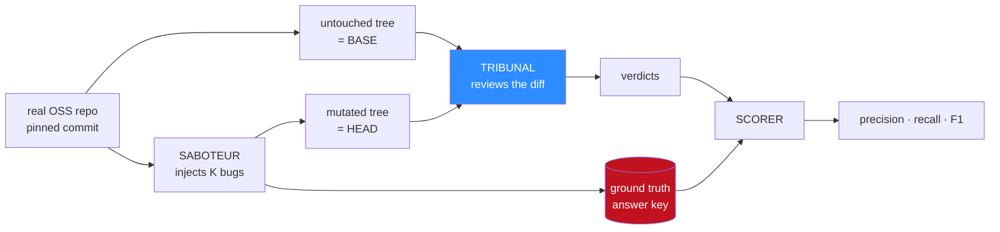

# 03 — The gym

A reviewer that measures its own precision is grading its own homework. TRIBUNAL needs an answer
key it did not write, and it needs one obtainable by a person with a laptop, Docker, and no
accounts.

The gym produces it. A **Saboteur** injects known defects into a real open-source Python
package; the **Reviewer** hunts them without ever seeing the list.

The red box never touches the blue one. That separation is the entire validity of the number at
the end, and [how it is enforced](#the-answer-key-is-unreachable-not-merely-unmentioned) is the
most important section of this document.

## Why generate the bugs instead of scraping them

The obvious alternative is a corpus of real historical bug-fix commits: take the fix, invert it,
call the parent commit buggy. SWE-bench-style datasets are built roughly this way and Martian's
benchmark is built from real pull requests.

That is a better dataset and the wrong tool for this project:

| | Scraped real bugs | Generated bugs |
|---|---|---|
| Realism | **High.** They actually happened | Moderate. Drawn from a taxonomy someone chose |
| Setup cost | Crawlers, API tokens, rate limits, storage | A pinned tag and a patch file |
| Bug distribution | Whatever history gave you | **Controllable.** Deliberately balanced |
| Runnable in a weekend on $3 | No | **Yes** |
| Can isolate one variable | Rarely | **Yes.** Hold the repo fixed, vary the bug class |

The decisive row is the last one. The measurement that matters in [06](06-experiments.md) is not
*"how good is TRIBUNAL"* in the abstract — it is *"what does the proof gate cost in recall,
holding everything else constant."* An ablation needs a stable, controllable population of
defects, and generated bugs give one.

The realism gap is real and is stated as a limit, not argued away.

## The rule that keeps the recall number honest

> **The gym may only inject bugs that a proof gate could in principle catch.**

This sounds like cheating and is the opposite. Recall is measured against the answer key, so
padding the key with defects no runtime test could ever expose — a misleading variable name, a
missing docstring, a design smell — would produce a recall figure that says nothing about the
proof gate and everything about the padding.

Every mutation in the taxonomy must therefore be **runtime-observable**: there must exist some
input for which the mutated code produces different observable behaviour from the original. A
mutation that is semantically equivalent is not a bug, and the Saboteur rejects it.

This is checked mechanically, not trusted. Every candidate mutation ships with a
**witness input** — a concrete call that demonstrates the behavioural difference — and the
Saboteur verifies the witness before the mutation is admitted to the answer key. A mutation
whose witness does not distinguish base from head is discarded and regenerated.

**The consequence is stated plainly: recall here is recall against runtime-observable defects.**
It is not recall against "all things a reviewer should catch," and [06](06-experiments.md)
labels it as such every time it is reported.

## The mutation taxonomy

Six classes, chosen to span easy-to-catch through genuinely subtle, each with a witness shape
the Saboteur must satisfy.

| Class | The mutation | Witness shape | Difficulty |
|---|---|---|---|
| **Boundary** | `<` becomes `<=`, `n` becomes `n-1`, a range endpoint shifts | An input exactly on the boundary | Easy |
| **Inverted predicate** | A condition is negated, or two branches swap | An input that takes the flipped branch | Easy |
| **Swallowed error** | `raise` becomes `pass`, or an `except` widens to bare | An input that should raise but now returns | Medium |
| **Silent coercion** | An `int()` / `str()` / truthiness conversion is inserted or dropped | An input where the types diverge | Medium |
| **State leak** | A default argument becomes mutable, or a cache is not cleared | **Two sequential calls.** Single-call tests cannot see it | Hard |
| **Resource leak** | A `close()` or context manager is removed | An assertion on handles after the call returns | Hard |

The bottom two rows are deliberately included even though they are the ones the reviewer will
most often miss. A benchmark composed only of off-by-one errors would report a flattering recall
number and teach nothing. The per-class breakdown in [06](06-experiments.md) is more informative
than the aggregate, and it is reported that way.

Two rules govern placement:

- **One mutation per function**, never stacked, so a verdict maps to exactly one ground-truth
  entry and the scorer has no ambiguity to resolve.
- **The target function must be reachable from the public API.** A mutation buried somewhere no
  caller can reach is unobservable by definition, and would silently deflate recall.

## The target repository

The gym needs a package that is small, pure Python, deterministic, and semantically interesting.
Those four constraints eliminate most candidates.

| Requirement | Why |
|---|---|
| Pure Python, no compiled extensions | The container must build in seconds, on any machine, offline |
| Full suite under ~10 seconds | Every finding costs six suite runs. A one-minute suite is an unusable gym |
| No network, no clock, no filesystem in the hot path | Every one of those is a flake source, and flakes destroy the protocol |
| Logic with real boundaries | Parsers, comparators and validators are dense with observable defects. Glue code is not |
| Permissive licence, pinned tag | The mutated tree gets committed to this repo |

**Recommended primary target: `python-semver`.** Version parsing and precedence comparison is
almost pure boundary logic — a comparator with prerelease ordering rules is a natural home for
off-by-one and inverted-predicate bugs that are subtle to read and trivial to witness. The suite
is small and instant, and there are no dependencies at all.

**Step-up target: `packaging`** (the PyPA library). Larger, still pure Python, still fast, with
specifier and requirement parsing that supports much nastier mutations. Reserved for after the
harness is proven, because a bigger diff costs more tokens per run and the budget is $3.

The target is configuration, not code. `gym/targets/<name>.yaml` pins the repository URL,
commit SHA, install command and test command, so adding a target means adding a file.

## The answer key is unreachable, not merely unmentioned

The reviewer must not know the answers. "We did not put them in the prompt" is not a guarantee —
it is a hope about an agent that writes and executes shell.

The isolation is structural, and every layer of it is enforced by something other than a prompt:

| Layer | Enforcement |
|---|---|
| The answer key lives outside the reviewer's world | `gym/runs/<id>/truth.json` is never mounted into any reviewer container |
| The reviewer cannot fetch the upstream repository | Containers run `--network none`. There is no route to PyPI or GitHub |
| The reviewer sees no VCS history | Trees are exported as plain directories, not clones. There is no `.git` to inspect |
| The mutations carry no marks | No comments, no distinctive formatting. The Saboteur's patch is applied and the tree is reformatted uniformly so mutated lines are not identifiable by style |
| Scoring happens in a different process | The scorer reads `result.json` and `truth.json`. The reviewer produced the first and cannot read the second |

`--network none` is doing the most work here, and it has a pleasant side effect: it also
eliminates the entire class of prompt-injection escape where a hostile diff talks the agent into
exfiltrating something. **The reviewer cannot reach anything because it has no network at all.**

The one operational cost is that dependencies must be pre-baked into the container image, since
they cannot be installed at review time. That is a feature — it also pins the environment for
reproducibility, which [02](02-burden-of-proof.md) requires of the manifest anyway.

## Scoring: matching a verdict to the answer key

A `PROVEN` finding counts as a **hit** when it can be tied to a ground-truth mutation. The match
is made on evidence, in priority order:

1. **Traceback attribution.** The failing test's stack trace passes through the mutated
   function. This is the strongest signal and it is free — the trace is already captured in the
   transcript required by [02](02-burden-of-proof.md).
2. **Location proximity.** The claim names a file and a line within the mutated hunk, plus or
   minus a small window.
3. **Witness overlap.** The finding's instrument and the mutation's witness exercise the same
   public entry point.

Signal 1 is the one that makes this work. A reviewer cannot fake its way into a stack trace that
passes through the mutated function; the trace is produced by the interpreter, not the model.

The resulting four buckets:

| Bucket | Definition |
|---|---|
| **Hit** | A `PROVEN` finding matched to a ground-truth mutation |
| **Miss** | A ground-truth mutation with no matching `PROVEN` finding |
| **False positive** | A `PROVEN` finding matching no mutation. Under the differential rule this should be near zero, and any occurrence is investigated individually rather than averaged away |
| **Suppressed** | Everything in the graveyard. Not scored, but reported, because it is the size of the gate's effect |

Two mutations landing in the same function are prevented at injection time precisely so this
matching stays unambiguous.

## The control run

One configuration matters as much as the main experiment: **the gym with `K=0`.**

The reviewer is handed a diff containing formatting-only changes and no injected defect. The
correct output is **zero findings**, and any `PROVEN` finding is a false positive with no
excuse available — there is nothing there to find.

This is the cheapest and most brutal test in the suite. A reviewer that cannot stay silent when
there is nothing to say is not a reviewer. It is run every time, and its result appears in
[06 — Experiments](06-experiments.md) as E4.

## The honest limits

- **Injected bugs are not real bugs.** They are drawn from a taxonomy a person wrote, which
  makes every number here a measurement against that distribution. Real defects are messier,
  more contextual, and often span multiple functions. This gap is the single largest caveat on
  every figure the project reports.
- **Only runtime-observable defects are in the key**, by construction. Recall against "all
  reviewable problems" is not measured and is not claimed.
- **One repository is not a benchmark.** A single well-chosen target proves the harness works
  and says very little about generality. Widening to several targets is M6, not a weekend.
- **The Saboteur is an LLM and will occasionally produce a semantically equivalent mutation.**
  The witness check catches these, but the check itself only proves a difference exists for the
  witness input — not that the difference is meaningful to a user.
- **A K=0 control cannot be run against a repository with a flaky suite** without producing
  phantom findings. The run-health check from [02](02-burden-of-proof.md) has to pass first, or
  the control result is meaningless.
- **Self-play has an inherent conflict.** The Saboteur and Reviewer share a model family and may
  share blind spots — the mutations one finds natural to write may be the ones the other finds
  natural to spot. Comparing against hand-authored mutations in M1 is the partial answer, and it
  is only partial.
