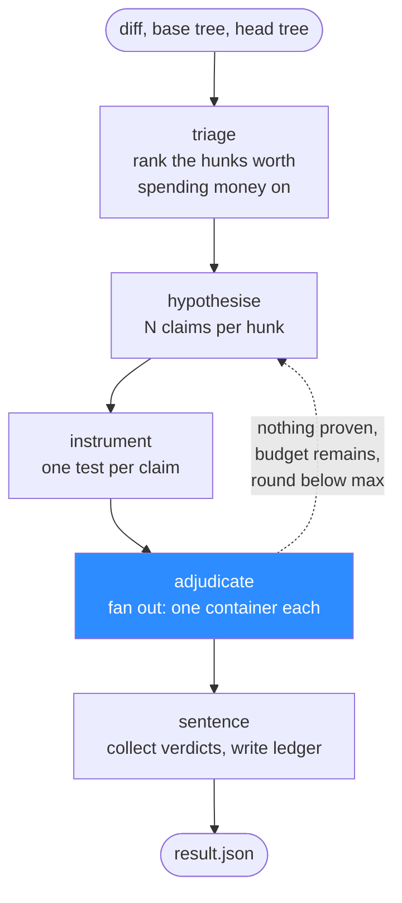
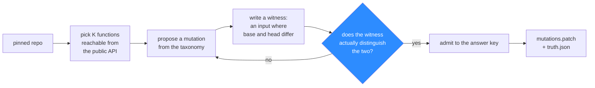

# 04 — Agents

Two agents, deliberately not one system.

| Agent | Job | Sees the answer key? |
|---|---|---|
| **The Saboteur** | Injects known, witnessed defects into a pinned repository | It writes it |
| **The Reviewer** | Prosecutes a diff, one hypothesis at a time, under the proof gate | Never. Structurally cannot |

They run as separate processes with separate state, separate containers and separate filesystem
mounts. Making them two nodes in one graph would be tidier and would destroy the only property
that makes the numbers mean anything.

## The Reviewer graph



Five nodes. The dashed edge is the only loop in the system and it is bounded twice — by round
count and by the budget ledger — because an unbounded retry loop on a metered API is how you
turn $3 into $30.

### triage

Ranks diff hunks by whether a runtime defect could plausibly hide there, and drops the rest.
Pure filtering: a lockfile change, a docs edit or a whitespace reflow is discarded before any
expensive stage sees it.

This node exists for cost, not quality. On a real diff, most hunks cannot contain a
runtime-observable bug, and every hunk that reaches `hypothesise` costs tokens. Triage is the
difference between reviewing a pull request for cents and reviewing it for dollars.

### hypothesise

Produces N short claims per surviving hunk. Each is one sentence naming a file, a symbol and a
concrete failure mode.

**This node is allowed to be wrong and is designed to be.** It is the cheapest model call in the
graph, run at a higher temperature than anything else, and its output has no authority
whatsoever. Improving it raises recall. It cannot raise the false-positive rate, because
[02](02-burden-of-proof.md)'s gate does not consult it.

The prompt's one hard requirement is falsifiability: a claim must name an input for which the
behaviour would be wrong. "This error handling looks fragile" is rejected at parse time, before
it costs anything further.

### instrument

Turns each claim into a standalone test file. This is the most demanding model call in the
system and the one most worth spending the better model on.

Three constraints are enforced after generation, by static check rather than by asking nicely:

- **No network.** An import of `requests`, `socket` or `urllib` is rejected outright. The
  container has no network anyway, so this only converts a confusing timeout into a clear
  rejection.
- **Public boundary only.** A test that reaches into a private helper is rejected. Such tests
  prove the code changed, which is already known, and go green-to-red across any harmless
  refactor.
- **Self-contained.** No fixtures, no conftest, no repository test helpers. The artefact must
  run on a stranger's checkout with nothing but the package installed, because
  [02](02-burden-of-proof.md) promises exactly that.

A claim that survives three attempts without producing a valid instrument is recorded
`INADMISSIBLE` and abandoned.

### adjudicate

The only node that decides anything, and the only node with no model in it.

Each instrument is executed against the base tree and the head tree, three times each. The node
collects six exit codes and applies the state machine from [02](02-burden-of-proof.md).

**No LLM is invoked here.** Not to interpret output, not to judge whether a failure is
convincing, not to summarise a traceback. The verdict is a function of exit codes. The moment a
model is allowed to weigh the evidence, the architectural guarantee collapses back into an
opinion with extra steps.

Adjudications fan out concurrently, bounded by a worker count, because this is the wall-clock
bottleneck and the containers are independent.

### sentence

Assembles the ledger directory described in [02](02-burden-of-proof.md), writes `result.json`,
and stops. Proven findings are rendered as comments; everything else is written to the graveyard
with its verdict and its transcript intact.

## State

```
ReviewState
  base_sha, head_sha      str
  hunks                   list[Hunk]           after triage
  hypotheses              list[Hypothesis]     accumulates across rounds
  instruments             dict[hyp_id, Path]
  verdicts                dict[hyp_id, Verdict]
  round                   int
  ledger                  Ledger               tokens and dollars, monotonic
```

Two properties are load-bearing:

- **Verdicts are append-only.** Nothing in the graph may revise a verdict once adjudicate has
  produced it. There is no node with the authority.
- **The ledger is monotonic and checked before every model call**, not after. Overspend is
  refused rather than reported.

LangGraph's checkpointer persists this to disk between nodes, so a crashed or interrupted run
resumes without re-paying for completed work. On a $3 budget that is not a convenience.

## Surviving on $3

The budget is a design input, not a footnote. Four mechanisms, in order of how much they save.

### 1. The cache is the big one

Every model call is keyed by `sha256(model + prompt + temperature + seed)` and cached to
`.cache/llm/`. A hit costs nothing and returns in microseconds.

The consequences are worth more than the money saved:

- **Re-runs are free.** Iterating on the harness, the scorer or the dashboard does not touch the
  API at all.
- **The demo is free and deterministic.** Recording a video, or re-running the demo on stage,
  replays cached completions. The same run produces the same output every time.
- **The cache is committable.** Shipping `.cache/llm/` alongside the repository means anyone can
  reproduce the exact published run with no API key whatsoever. For a project whose entire
  argument is *verify, do not trust*, that is a strong position to be in.

### 2. The ledger refuses, it does not warn

A hard cap in dollars, checked before each call, with the estimated cost of that call included.
Exceeding it produces `BUDGET_HALTED`, and [02](02-burden-of-proof.md) requires that a halted
run be reported as invalid rather than as a clean run that found nothing.

Per-node sub-budgets prevent a single pathological hunk from consuming the whole allowance in
`instrument` retries.

### 3. Cheap model by default, expensive model in one place

`hypothesise` and `triage` run on the fast tier — they are high-volume and allowed to be wrong.
`instrument` may use the better tier, because a failed instrument wastes a container and a retry
rather than just a token.

`adjudicate` and `sentence` use no model at all, which is most of the point of the design.

### 4. Small diffs

Triage discards non-code hunks before they reach a prompt, and the gym's diffs are single-
function mutations by construction. A gym run is a few hundred tokens of context, not a few
thousand.

**Realistic arithmetic** for one gym run — 15 injected bugs, ~40 hypotheses, ~40 instruments —
lands in the low tens of cents on a fast-tier model. The $3 allowance covers roughly a dozen
uncached full runs, and unlimited cached ones. The budget is genuinely sufficient; the ledger
exists so that a bug in the retry loop cannot make it insufficient.

### Configuration

Environment variable names are shared with the sibling `surreal_db` project deliberately, so one
`.env` works across this repository:

| Variable | Default | Purpose |
|---|---|---|
| `OPENAI_API_KEY` | *(required)* | Server-side only. Never exposed to the browser |
| `OPENAI_BASE_URL` | *(unset)* | Any OpenAI-compatible endpoint, including a local one |
| `LLM_MODEL` | `gpt-5.6-terra` | The `instrument` node |
| `LLM_MODEL_FAST` | `gpt-5.6-luna` | `triage` and `hypothesise` |
| `TRIBUNAL_BUDGET_USD` | `0.50` | Per-run hard cap. The ledger refuses past this |
| `TRIBUNAL_CACHE` | `.cache/llm` | Set empty to disable, which nothing should ever do |

## The container model

Adjudication needs to run untrusted, model-authored code against a target repository, many times
per review. Three options, and the boring one wins.

| Approach | Verdict |
|---|---|
| Docker-in-Docker | Privileged containers and a nested daemon, for no benefit here. Rejected |
| Host subprocess with a venv | Fast, and it executes model-authored code on the developer's machine with their credentials in scope. Rejected |
| **Host socket, ephemeral containers** | The arena mounts `/var/run/docker.sock` and spawns one short-lived container per adjudication. **Chosen** |

Each adjudication container:

- starts from a pre-baked image with the target's dependencies already installed, because
  `--network none` means nothing can be fetched at review time;
- mounts the tree read-only and the single instrument file read-only;
- runs `--network none`, with a memory cap, a CPU cap and a wall-clock timeout;
- has no environment variables, no API key, no `.git`, and no answer key;
- exits, and is removed.

**The security posture is stated honestly:** mounting the Docker socket grants the arena process
root-equivalent access to the host. That is acceptable for a local research tool run by its own
author against a pinned repository, and it is **not** acceptable for a hosted service. A real
deployment needs gVisor, Firecracker or per-tenant VMs. The `--network none` flag protects the
*target* from the reviewer and the reviewer from a hostile diff; it does not protect the host
from the arena.

## The Saboteur

A much smaller agent, run once, and its output committed.



The witness check is the whole quality bar, and it is mechanical: the witness runs against both
trees and must produce different observable results. A mutation that fails this check is
semantically equivalent and is not a bug, so it is regenerated rather than admitted.

**The Saboteur runs once and its output is committed** — `mutations.patch`, `truth.json`, and
the generation transcript. Every subsequent run of the gym replays those files at zero cost.
This mirrors `surreal_db/db/fake_writer.py`: generate once with a model, commit the artefact,
replay forever.

M1 goes one step further and hand-authors the first mutation set with no model at all, so the
harness can be proven correct before any LLM is in the loop. See [07 — Roadmap](07-roadmap.md).

## The honest limits

- **`triage` can throw away a real bug.** It is a cost optimisation that reduces recall by an
  amount nobody measures, and its cut is invisible in the graveyard because it happens before
  hypotheses exist. Logging triage rejections is the mitigation and it is not a fix.
- **The cache makes results stale by design.** A committed cache reproduces a *past* run
  perfectly and tells you nothing about the current model. Both properties are wanted; confusing
  them would be dishonest.
- **Docker socket access is root on the host.** Stated above, restated here so it is not missed:
  this design is safe for a local tool and unsafe as a service.
- **Per-adjudication container startup dominates wall clock.** Six runs per finding, each in a
  fresh container, is seconds of overhead per hypothesis. Reusing a warm container per finding
  would be faster and weaker, and the trade has not been measured.
- **The Saboteur and Reviewer share a model family** and may therefore share blind spots. The
  hand-authored M1 mutation set exists partly as a control for this and only partly answers it.
- **LangGraph is not doing anything exotic here.** It is a bounded state machine with a
  checkpointer. The interesting part of this project is the gate, not the graph, and claiming
  otherwise would be padding.
