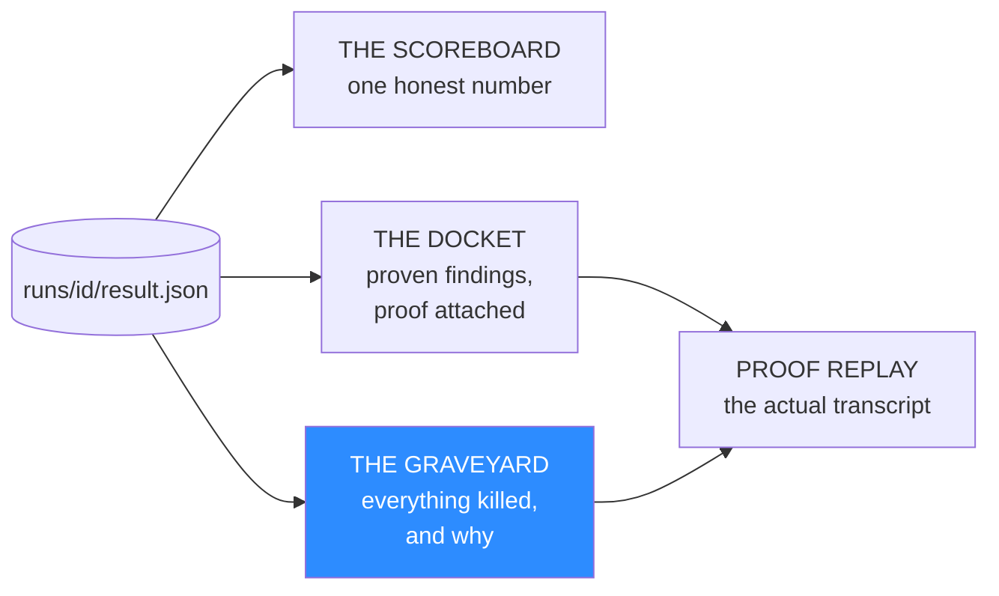
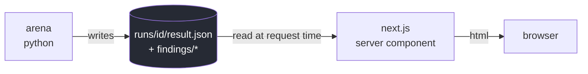

# 05 — UI

The dashboard has one job, and it is not showing findings.

> **It has to make suppression visible.**

Any reviewer can list what it found. The claim TRIBUNAL is making is about what it *refused to
say*, and a claim like that is worthless unless it is on screen, countable, and clickable down
to the exit code that produced it.

## The three surfaces



The graveyard is highlighted because it is the panel that does not exist in any competing
product, and it is the reason to build a UI at all rather than printing to a terminal.

## The scoreboard

The landing view. Six numbers, no charts, no gauges, no sparklines.

```
  RUN 2026-09-05T14:22:11Z          semver @ a3f9c1e → mutated

  PROVEN            11              of 15 injected
  DISMISSED         28              executed and killed
  PRE-EXISTING       4              true, but not this diff
  INADMISSIBLE       6              could not be instrumented
  QUARANTINED        1              flaky, withheld
  ─────────────────────────────────────────────────────────
  FALSE POSITIVES    0              proven, matching no bug
  COST            $0.11             •  4m 12s  •  49 containers
```

Design rules for this panel, each with a reason:

- **`PROVEN` and `FALSE POSITIVES` are the only numbers in the accent colour.** They are the
  claim. Everything else is supporting detail.
- **The suppressed counts are shown at equal weight**, not tucked into a footer. The size of
  that pile is the product.
- **Cost is always displayed.** A precision claim without its cost is a half-measurement, and
  [06](06-experiments.md) treats cost per proven finding as a headline metric.
- **No percentages on this panel.** Raw counts. A percentage invites averaging across runs and
  hides that N is small.

If the run was `BUDGET_HALTED` the entire panel is replaced by a halt notice. A run that ran out
of money must never render as a run that found nothing — [02](02-burden-of-proof.md) requires
this and the UI is where it would most easily be violated.

## The docket

Proven findings, in a list. Each row expands in place to the artefact.

```
  ▸ 001   semver/_compare.py:88     prerelease ordering inverted for numeric identifiers
          PROVEN · base 3/3 pass · head 3/3 fail · 1.4s
```

Expanding a row shows four things and no prose summary:

| | |
|---|---|
| **The claim** | One sentence. Not a paragraph, not a severity badge, not a suggested fix |
| **The instrument** | The full test, syntax-highlighted, with a copy button |
| **The differential** | Base runs and head runs side by side, exit codes visible |
| **The command** | `pytest findings/001-proven/test_finding.py`, ready to paste |

There is **no severity field and no confidence score.** Both were considered and both are
excluded on principle: a finding is proven or it does not exist, and attaching a probability to
a proof would reintroduce exactly the judgement call [01](01-concept.md) argues against.

`BEHAVIOUR_CHANGE` findings — proven, but plausibly intentional per the intent check in
[02](02-burden-of-proof.md) — appear in a separate section below the docket, worded as a
question rather than an accusation, and never mixed in with the bugs.

## The graveyard

The signature panel. Every killed hypothesis, grouped by verdict, each one expandable to the
same artefact view as a proven finding.

```
  DISMISSED  28    the test passed on head too. the claim was wrong
  ▸ h-014   semver/version.py:41    "build metadata is compared during precedence"
            base 3/3 pass · head 3/3 pass · killed in 0.9s

  PRE-EXISTING  4  fails on base as well. real, but not this diff
  ▸ h-022   semver/_parse.py:12     "empty string raises the wrong exception type"
            base 3/3 fail · head 3/3 fail · killed in 1.1s
```

Two deliberate choices:

- **Killed hypotheses are rendered at full fidelity**, with the same expandable artefact as a
  proven one. Rendering them as a greyed-out count would defeat the purpose — the reader has to
  be able to inspect a specific suppressed comment and agree it deserved to die.
- **The verdict distribution is the diagnostic.** The grouping headers double as the debugging
  table from [02](02-burden-of-proof.md): mostly `DISMISSED` means the hypothesis stage is
  hallucinating, mostly `INADMISSIBLE` means the harness cannot instrument this codebase, mostly
  `QUARANTINED` means the target's suite is unstable and the whole run is void.

There is a toggle at the top of this panel labelled **"show me what a normal reviewer would have
posted"**, which merges the graveyard into the docket. That view is the demo's punchline: the
same model, the same diff, the gate removed — 49 comments instead of 11.

## Proof replay

Clicking any verdict, proven or killed, opens the recorded container transcript and plays it
back at its original timing.

```
  ┌ base · run 1/3 ─────────────────────────────────────┐
  │ $ docker run --rm --network none tribunal/semver ... │
  │ collected 1 item                                     │
  │ test_finding.py .                              [100%]│
  │ 1 passed in 0.11s                                    │
  │ exit 0                                               │
  └──────────────────────────────────────────────────────┘
```

This is a replay of a captured log, not a live session — there is no shell, no input, nothing
executes in the browser. It exists because the difference between *"the tool says it proved
this"* and *"here is the process exiting non-zero"* is the entire difference the project is
built on, and it should be one click away.

## Data flow: there is no database

The arena writes `runs/<id>/result.json`. The dashboard reads it. That is the whole
architecture.



- **No database.** A run is an immutable directory. Adding Postgres to serve a JSON file that is
  written once would be pure ceremony.
- **Server components read the filesystem directly.** No API route, no client-side fetching, no
  state library. A run is static content by the time anyone looks at it.
- **Live progress is a tail, not a socket.** While a run is in flight the arena appends to
  `events.jsonl` and the page polls it every second. Watching hypotheses die in real time is the
  best moment in the demo and it does not justify a WebSocket.
- **No credential ever reaches the browser.** There is no `NEXT_PUBLIC_*` variable in this
  project at all. The dashboard is a reader of files.

## Visual language

The design tokens are taken directly from `surreal_db/docs/design.md`, unchanged, so all three
projects in this repository read as one portfolio.

| Token | Value | Used for |
|---|---|---|
| `background` | `#0B0F19` | Page |
| `surface` | `#262A34` | Cards, panels, the transcript frame |
| `primary` / `accent` | `#2D8CFF` | `PROVEN`, the differential rule, the one thing to look at |
| `text-primary` | `#FFFFFF` | Claims, counts |
| `text-secondary` | `#A1A1AA` | Verdict metadata, timings, paths |
| display | DotGothic16, 64px | The scoreboard's headline numbers only |
| body / labels | JetBrains Mono | Everything else |

Three rules beyond the tokens:

- **Mono everywhere.** This is a tool that reads exit codes; a proportional font would be
  dishonest about what it is.
- **One accent colour, used sparingly.** Red is reserved for `FALSE POSITIVES` being non-zero,
  which should be a rare and alarming sight. Killed hypotheses are *not* red — they are the
  system working correctly, and colouring them as failures would invert the entire message.
- **Motion only where it carries information.** Hypotheses dying during a live run animate,
  because that transition *is* the content. Nothing else moves.

## What is deliberately not built

- **No inline code viewer.** The diff is in the repository. Rebuilding a file browser would be a
  week of work that adds nothing to the argument.
- **No GitHub integration, no PR comments, no OAuth.** The design must run with no accounts —
  see the constraints in [07](07-roadmap.md). Posting to a real pull request is M6.
- **No run comparison view.** Comparing two runs matters for the ablations in
  [06](06-experiments.md), and those are produced as a table by the scorer, not a UI.
- **No settings page.** Configuration is environment variables and a target YAML file.
- **No dark/light toggle.** There is one theme.

## The honest limits

- **The dashboard is a viewer, not a workflow.** There is nowhere to triage, dismiss, or reply
  to a finding, which is most of what a reviewer's UI actually does in practice.
- **Counts are small and percentages would mislead.** With 15 injected bugs, one extra hit moves
  recall by seven points. The UI shows raw counts for this reason, and it makes the panel look
  less impressive than a percentage would.
- **The "show what a normal reviewer would post" toggle is not a fair comparison.** It is this
  reviewer with its gate removed, not a competing product. It demonstrates the gate's effect,
  and it is not a benchmark against anyone.
- **Replay is a recording.** It proves what happened during the run; it does not prove the same
  thing would happen now. The manifest's pinned image digest and commit SHAs are what make
  re-running possible, and re-running is the actual verification.
