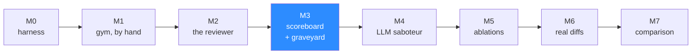

# 07 — Roadmap

Eight milestones. Each one is independently demoable, and each one names the single thing that
has to be true before it counts as done.

The ordering is not arbitrary. **The riskiest and least glamorous work is first**, and no
milestone before M2 involves an LLM at all. If the differential harness does not work, nothing
downstream is worth building, and finding that out on hour three is cheaper than finding it out
on hour twenty.

**M3 is the weekend.** Everything through it is shippable as a complete story with a real
number; everything after it is expansion.

---

## M0 — The differential harness

No agents. No LLM. No API key.

A function that takes a base tree, a head tree and a test file, runs the test in an ephemeral
`--network none` container against both, three times each, and returns one of the six verdicts
from [02](02-burden-of-proof.md).

Plus the pre-baked target image, the ledger directory writer, and the
`tribunal/targets/semver.yaml` target definition.

**Exit criterion.** Hand-write two tests — one that fails only on head, one that fails on both —
and watch the harness return `PROVEN` and `PRE_EXISTING` without a model existing anywhere in
the codebase.

**Why first.** This is the load-bearing claim of the whole project. If containers are slow, if
the target will not install offline, if the suite is flaky — that is the news, and it arrives
here or it arrives too late.

---

## M1 — The gym, hand-authored

Six mutations, one per class from [03](03-gym.md), written by a person with no model involved.
Each with its witness. `mutations.patch` and `truth.json` committed.

Plus the scorer: traceback-first matching, and the four buckets.

**Exit criterion.** `make gym` produces the mutated tree, the harness adjudicates the six
hand-written witness tests, and the scorer reports 6/6 recall and zero false positives.

That number proves nothing about the reviewer — the tests were written by a human who knew the
answers. **It proves the measuring instrument is calibrated**, which is what has to be true
before any reviewer number means anything.

---

## M2 — The reviewer

The LangGraph graph from [04](04-agents.md): triage, hypothesise, instrument, adjudicate,
sentence. The disk cache. The budget ledger. First API key.

**Exit criterion.** Point it at the M1 mutated tree. It proves **at least one** injected bug it
was never told about, and publishes zero false positives, for under fifty cents.

One proven bug is the right bar. The first time a hypothesis the model invented survives base-
pass/head-fail and lands in the ledger with its transcript, the thesis is demonstrated. Getting
from one to eleven is tuning.

---

## M3 — Scoreboard and graveyard · **the weekend ends here**

The Next.js dashboard from [05](05-ui.md): the six-number scoreboard, the docket, the graveyard
with per-verdict grouping, proof replay, and the
*"show me what a normal reviewer would have posted"* toggle.

`docker compose up` starts the arena and the dashboard together.

**Exit criterion.** A stranger with Docker and an API key runs one command, watches hypotheses
die in real time, opens the graveyard, expands a dismissed finding, reads the exit codes that
killed it, and flips the toggle to see the 40-comment version they were spared.

**This is the demo.** It has a number, a visual nobody else ships, and a punchline. Everything
after this milestone makes the project more rigorous; nothing after it makes the project more
persuasive.

If the weekend runs short, the honest cuts in order are: proof replay animation, the live tail
(read the finished JSON instead), and per-verdict grouping in the graveyard. The scoreboard, the
graveyard and the toggle are not cuttable — they are the argument.

---

## M4 — The LLM Saboteur

Replace the hand-authored mutations with the generation loop from [04](04-agents.md): propose,
witness, verify the witness distinguishes base from head, admit or regenerate.

Run once at `K=15`. Commit the patch, the answer key and the generation transcript.

**Exit criterion.** Fifteen admitted mutations spanning all six classes, every witness verified
mechanically, and a diff against the M1 hand-authored set showing whether the model's mutations
are meaningfully different in kind from a human's.

That comparison is the only real check on the shared-blind-spot problem named in
[03](03-gym.md), and it is worth doing even though it only partly answers the question.

---

## M5 — The ablations

E2 through E6 from [06](06-experiments.md): the gate-off control, cost per proven finding, the
silence test, flake sensitivity at `N ∈ {1,3,5}`, and the intent-change set.

**Exit criterion.** A committed results table with every pre-declared pass bar marked met or
missed, and the LLM cache committed so every row is reproducible without an API key.

**Including the rows that fail.** The pass bars in [06](06-experiments.md) were written before
any code existed precisely so this milestone cannot quietly move them.

---

## M6 — Real diffs

Drop the gym. Accept `git diff base..head` on any local repository with a runnable test suite.

Requires target auto-detection (install command, test command, Python version), a real triage
stage that survives a hundred-file pull request, and graceful degradation when a repository
cannot be containerised — which must produce an explicit *"cannot review this"* rather than a
confident empty result.

**Exit criterion.** Run it against a real merged pull request in a real open-source project.
Any proven finding is either a genuine bug or a deliberate behaviour change, verified by hand.

**This is where the design meets the world**, and where the narrow-window limitation from
[02](02-burden-of-proof.md) will show up in full: most real pull requests will produce zero
proven findings, because most real pull requests do not contain a runtime-observable regression.
Zero is the correct answer and it is a much less exciting demo than the gym.

---

## M7 — The comparison

Run a shipping reviewer against the same gym and score it with the same matcher.

Needs a GitHub organisation, a repository per run, the tool installed, and — most importantly —
a harness that is genuinely fair to a product designed for a different job. A comparison that
scores a general reviewer on a benchmark of runtime-observable mutations is measuring the wrong
thing about it, and that has to be said in the write-up, prominently, not in a footnote.

**Exit criterion.** A comparison table that someone from the compared team would call fair.

**No competitive claim is made anywhere in this project until this milestone is done.** Every
number before M7 is TRIBUNAL measured against itself.

---

## What is deliberately deferred

| Deferred | Until |
|---|---|
| Multiple target repositories | After M6. One target proves a harness, not a claim |
| Languages other than Python | Never, on current design. The container and test conventions are Python-shaped |
| Performance-regression proof | Indefinitely. Laptop timing is not measurement |
| Hosted service | Indefinitely. The Docker-socket model in [04](04-agents.md) is root on the host |
| Posting to real pull requests | M6 at the earliest, and it needs the M6 "cannot review this" path first |
| Auto-fix | Never. [01](01-concept.md) — a system that diagnoses and treats has an incentive to diagnose |

## The risks, ranked by what would actually kill this

1. **Recall is catastrophically low.** If the gated reviewer proves two of fifteen bugs, the
   design is a curiosity. M2's one-bug bar is set low on purpose so this surfaces early, and
   [06](06-experiments.md) publishes the number either way.
2. **The model cannot write self-contained tests.** A high `INADMISSIBLE` rate means the whole
   protocol has no fuel. Visible in the M2 graveyard immediately.
3. **The target suite is flaky.** Quarantine everything and nothing is provable. M0's exit
   criterion catches this before a single token is spent.
4. **Container overhead dominates.** Six containers per hypothesis, forty hypotheses per run. If
   startup is two seconds, a run is eight minutes and the demo drags. Measured at M0, mitigated
   by fanning out.
5. **Real pull requests produce nothing.** The most likely long-term outcome, and the honest one:
   a gate this strict is silent on most real changes. M6 finds out. That result would still be
   worth publishing — *"here is how rarely an AI reviewer can actually prove anything"* is a more
   interesting article than most of what the category produces.
