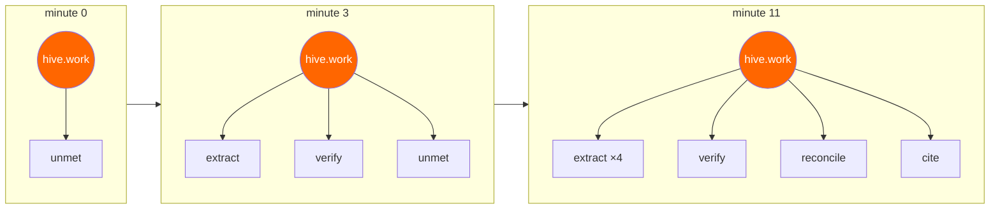

# HIVE

**Nobody drew this architecture diagram. The system did, while it was running.**

HIVE is a colony of AI agents with **no predefined graph**. You give it a goal. It discovers what
capabilities it lacks, invents specialist roles to cover them, declares their queues and bindings in
RabbitMQ, staffs them from a pool of generic workers — and lets the roles that stop earning their
keep die.

The org chart is not configuration. It is an outcome. Run the same goal twice and you get two
different architectures.

Three snapshots of one run. Every box is a real queue that a real agent created because the work
demanded it.

---

## How a colony grows

The whole loop runs on native broker mechanisms. None of it is simulated in Python.

| What happens | The RabbitMQ feature doing it |
|---|---|
| A task arrives that **no existing role can handle** | It matches no binding, so the **alternate exchange** catches it |
| The colony notices it keeps failing at the same thing | The unmet queue is the evidence, and it needs no polling loop |
| A new specialist is born | Runtime `queue.declare` + `queue.bind` |
| Somebody staffs it | A fanout **job market** — idle workers compete for the posting, first ack wins |
| A role stops being useful and disappears | **`x-expires`** — the broker deletes an unused queue by itself |
| You replay how the architecture evolved | A **stream**, read from any `x-stream-offset` |

The first row is the elegant part. **An unroutable message is a capability gap.** The colony learns
what it is missing by *failing to route* — no supervisor, no polling, no LLM call to notice.

---

## The part we did not hide

RabbitMQ's own guidance says applications with dynamic topologies should *"switch to use a static set
of exchanges and bindings."* In 4.3 the metadata store is **Khepri**, which is Raft-based, so every
declaration is a consensus write — and bulk deletion of queues and bindings is one of its slower
operations.

**Their docs advise against exactly what HIVE does.** So the design takes that seriously rather than
pretending otherwise:

- **Two clocks.** Messages move in milliseconds. *Structure* changes on a slow, budgeted cadence.
- **A role must be earned** — recurring unmet demand over a window, never a single stray message.
- **Curing.** A new binding is verified through the management API before anything routes to it,
  because propagation is not instant.
- **Death is lazy.** `x-expires` retires roles one at a time, which avoids the exact bulk-delete
  operation Khepri is worst at.

[06 — Experiments](docs/06-experiments.md) measures the real cost of that churn instead of assuming
it is fine.

---

## Containing an agent that can rewrite the broker

The Architect can declare and delete broker objects. That is genuinely dangerous, and the containment
is not a paragraph in a prompt:

> It connects as a RabbitMQ user whose `configure` permission is a **regex scoped to `^hive\.` and
> `^q\.role\.`**. Whatever it decides — or whatever a malicious task payload talks it into — it
> cannot touch anything else in the vhost.

The blast radius is enforced by the broker. See [03 — Topology](docs/03-topology.md).

---

## What you see in the demo

| Do this | Watch this |
|---|---|
| Give it a goal and walk away | Queues appear. Bindings draw themselves. The graph reorganises |
| Open a role dossier | Why that role was born, what it cost, what it produced |
| Feed it a task outside every role's competence | It lands in `unmet`, and a few minutes later a new specialist exists |
| Stop sending a kind of work | That role goes quiet, its worker leaves, and the queue evaporates |
| Drag the morphogenesis scrubber | The entire evolution of the architecture, replayed from the stream |
| Run the identical goal twice | Two different org charts. That is the point |

---

## Status

**Design complete, implementation not started.** Every document below is written to be built from
directly; build order is in [07 — Roadmap](docs/07-roadmap.md).

Requires RabbitMQ **4.3+**, Docker, and an OpenAI API key. The key lives only in server-side
containers — no `NEXT_PUBLIC_*` variable carries a credential.

---

## Documents

| Doc | What's in it |
|---|---|
| [01 — Concept](docs/01-concept.md) | Why hand-drawn agent graphs are the wrong shape, and what emergence actually buys |
| [02 — Morphogenesis](docs/02-morphogenesis.md) | The growth loop: sense, propose, cure, live, die. The core document |
| [03 — Topology](docs/03-topology.md) | Exchanges, capability routing, `x-expires`, and the permission scoping |
| [04 — Agents](docs/04-agents.md) | The Architect, the cells, and the job market |
| [05 — UI](docs/05-ui.md) | The morphing topology, the timeline, the role dossiers |
| [06 — Experiments](docs/06-experiments.md) | Does emergence beat a human design? Measured honestly |
| [07 — Roadmap](docs/07-roadmap.md) | M0–M7, each independently demoable |
