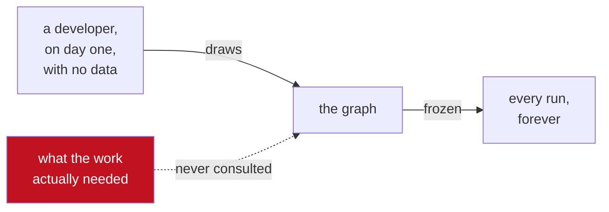
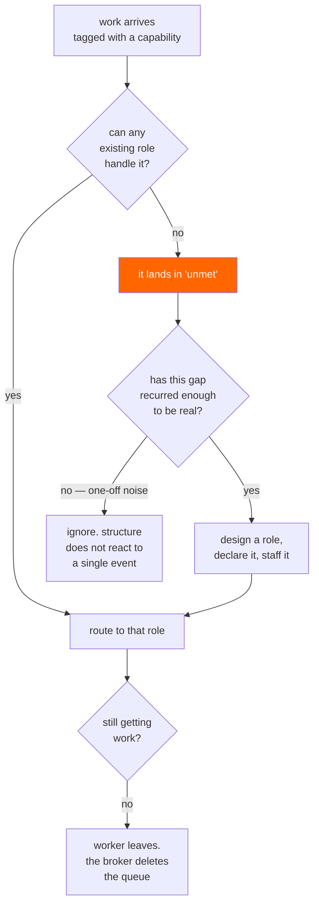

# 01 — Concept

## The assumption nobody questions

Every multi-agent framework asks you to draw the graph first.

You decide there will be a planner, three researchers, a critic and a writer. You wire them together.
You deploy. And then the system runs that shape forever, regardless of what the work turns out to
need.

This is a strange thing to be confident about. You are guessing — before seeing a single task — how
labour should be divided, how many specialists are worth having, and where the boundaries between
them fall. Those are exactly the questions that a real organisation takes months of contact with real
work to answer, and revises constantly afterwards.

The guess is often fine. It is also never revisited, and it is never *measured* — because the graph
is source code, and source code does not tell you it was wrong.

## What HIVE does instead

**Start with nothing and let the structure be an outcome.**

HIVE begins with no roles at all. Work arrives tagged with the capability it requires. If some role
can handle it, it routes there. If nothing can, that failure is recorded — and when the same kind of
failure keeps happening, the colony designs a specialist to cover it, wires it into the topology, and
staffs it.

Roles that stop receiving work fall idle, lose their worker, and are deleted by the broker.

So the architecture is a **living response to the workload**, and at any moment it is legible: every
role exists because of specific evidence, and that evidence is still there to read.

## Why a message broker is the right substrate

The idea would be a curiosity if it needed a pile of machinery to implement. It does not — every step
is a RabbitMQ feature already doing its intended job.

**A capability gap is an unroutable message.** Work is published to a topic exchange with routing keys
that name capabilities: `cap.extract.pdf`, `cap.verify.claim`, `cap.cite.source`. Roles bind to the
patterns they can serve. A task that matches nothing is, by definition, work the colony cannot do —
and RabbitMQ already has a mechanism for messages that match nothing: the **alternate exchange**.

That is the whole sensing apparatus. No supervisor process, no polling loop, no LLM call to notice
the gap. The routing table *is* the colony's model of its own competence, and the broker maintains it.

**Death needs no code either.** `x-expires` deletes a queue that has gone unused for a given period.
A role whose worker has left is a queue with no consumers, so it evaporates on its own. Nothing has
to decide to kill it; it simply stops being kept alive.

Two features that exist for entirely mundane reasons — misrouted messages and cleaning up abandoned
queues — turn out to be a sensory organ and a mortality mechanism. That is why this is a RabbitMQ
project rather than an agent-framework project that happens to use a queue.

## The constraint, stated up front

RabbitMQ's own operational guidance says applications with dynamic topologies should *"switch to use
a static set of exchanges and bindings."*

**Their documentation advises against exactly this.** It is worth understanding why before deciding
they are wrong.

In 4.3 the metadata store is **Khepri**, which is Raft-based: exchanges, queues and bindings are
replicated cluster state, so every declaration and deletion is a consensus write. Bulk deletion of
many queues and bindings is one of Khepri's slower operations, and high binding churn has
historically been a problem area. A naive implementation of this idea — declaring and tearing down
topology per task — would hammer the metadata store and deserve the warning.

HIVE's answer is not to disagree but to change the timescale:

> **Messages flow in milliseconds. Structure changes in minutes.**

Structural change is treated as an expensive architectural act, because it is one. The colony
*proposes* constantly and *commits* rarely, under a hard budget, only on repeated evidence, and it
never mass-deletes anything. [02 — Morphogenesis](02-morphogenesis.md) is that discipline, and
[06 — Experiments](06-experiments.md) measures the actual cost rather than assuming it is acceptable.

An emergent architecture that ignores the broker's constraints would be a demo. One built around them
is a design.

## Where LangGraph belongs

Stated plainly, because overclaiming here would lose any reader who knows both tools:

> **LangGraph inside a role. RabbitMQ between roles.**

A single agent's own reason → act → observe loop is tight, stateful, sub-second and in-process. That
is what LangGraph is for, and routing those internal steps through a broker would mean paying a
network hop to decide whether to call a calculator.

What does not belong in-process is the part between agents — the handoff that outlives a worker, the
capability match, the structure itself. HIVE is not a replacement for LangGraph. It is the thing that
decides *which* LangGraph agents should exist.

## Why the RabbitMQ team should care

- It uses **alternate exchanges and `x-expires` as sensing and mortality** — a reading of two ordinary
  features that their documentation does not make, and that is immediately obvious once seen.
- It engages **honestly with the Khepri constraint**, including the part where their own guidance says
  not to do this. Anyone can build a demo that churns topology; the interesting work is the budget,
  the curing step and the lazy death that make it defensible.
- It treats **the broker as the source of truth for system structure**, not just for messages in
  flight. The management API is not a dashboard here; it is how the system perceives itself.
- It is genuinely a **new category of demo** for a message broker. The screenshot is an architecture
  diagram that nobody drew.

## The honest limits

Written here rather than discovered by a skeptical reader:

- **Emergent does not mean better.** A colony may converge on a structure a competent engineer would
  have improved on. [06](06-experiments.md) compares against a human-designed baseline and publishes
  the result either way.
- **It is not deterministic.** Two runs of the same goal produce different architectures. That is the
  demo *and* the operational problem, and anyone deploying this needs to want that trade.
- **It costs tokens to think about itself.** Designing roles is LLM work that produces no output for
  the user. [06](06-experiments.md) measures that overhead as a first-class metric.
- **It needs volume to work.** A colony given six tasks will never see a gap recur, and will
  therefore never grow. This design is pointless below a certain throughput, and that threshold is
  worth knowing.

## Non-goals

- **Replacing LangGraph.** Stated above.
- **Unbounded self-modification.** The role space is capped, the change budget is hard, and the
  Architect's broker permissions are regex-scoped. A system that can rewrite its own structure needs
  limits enforced somewhere other than a prompt.
- **A workflow DSL.** No visual builder, no schema for describing pipelines. The topology is the
  design artefact, and it is read from RabbitMQ.
- **Beating a hand-drawn graph on latency.** An emergent structure has to sense, decide and cure
  before it helps. It will lose on a short run, and [06](06-experiments.md) reports that rather than
  choosing a workload where it does not.
