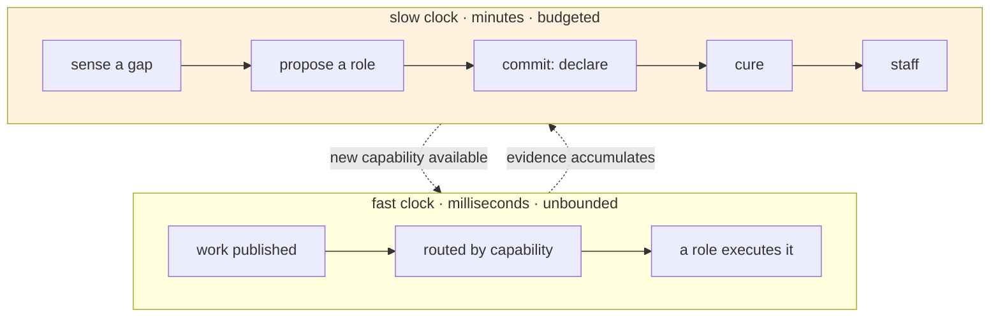
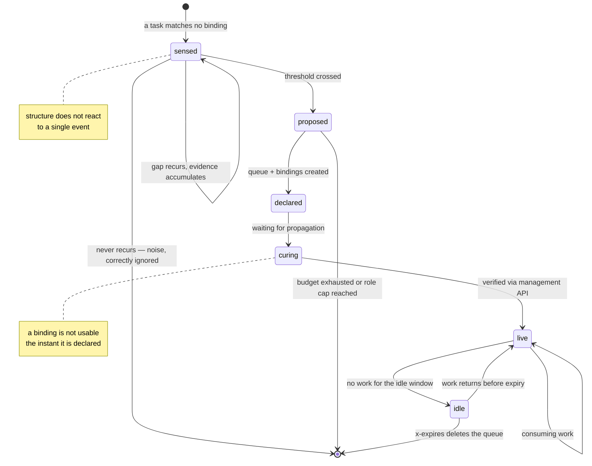
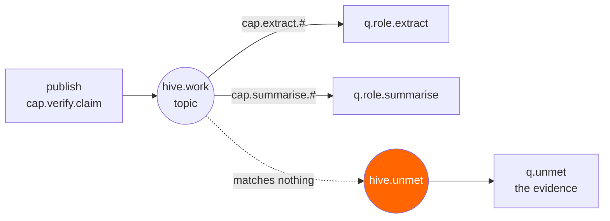
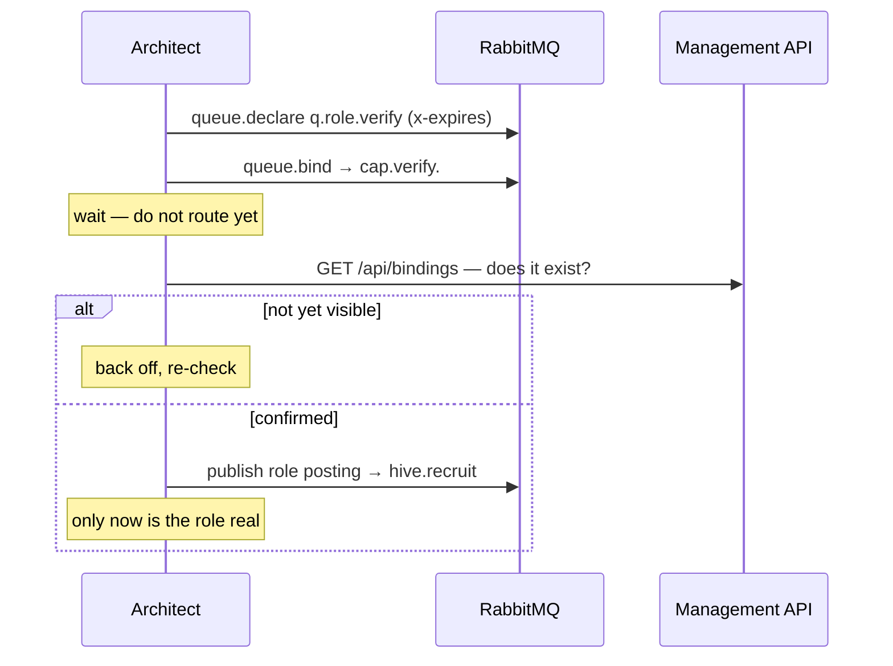
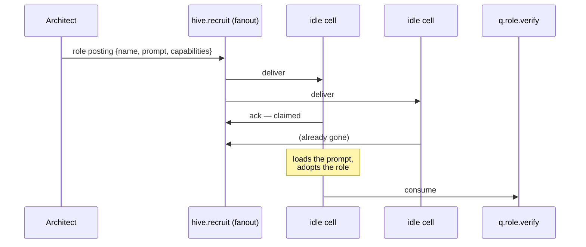

# 02 — Morphogenesis

How a role is born, verified, staffed, and allowed to die. This is the core of the project.

## The two clocks

Everything here follows from one decision:

> **Messages flow in milliseconds. Structure changes in minutes.**

A colony that restructured itself per task would be both incoherent and hostile to the broker — in
4.3 every declaration is a Khepri (Raft) consensus write, and RabbitMQ's own guidance prefers static
topologies. So HIVE separates the fast loop from the slow one and lets them run at honest speeds.

The fast loop never blocks on the slow one. Work that cannot be routed today is not lost — it waits
in `q.unmet` while the colony decides whether this is a real gap, and is replayed once a role exists
to handle it.

## The lifecycle

Two states in that diagram exist purely because of things that are true about RabbitMQ, and they are
the two that a naive implementation would omit.

---

## 1. Sense

Work is published to `hive.work`, a topic exchange, with a routing key naming the required
capability — `cap.extract.pdf`, `cap.verify.claim`. Roles bind to the patterns they serve.

A task matching no binding is, by definition, work the colony cannot do. RabbitMQ already handles
messages that match nothing: `hive.work` carries an **`alternate-exchange`** pointing at
`hive.unmet`, and everything unroutable lands in `q.unmet`.

**This is the entire sensing apparatus.** No supervisor, no polling, no LLM call to notice the gap.
The routing table is the colony's model of its own competence, and the broker maintains it as a side
effect of routing.

Three properties of alternate exchanges that shape the design, all documented behaviour:

- **The AE must exist before the primary exchange references it.** If it does not, unroutable
  messages are discarded with only a log warning. Silent data loss, so `hive.unmet` is declared first
  at bootstrap and its existence is asserted at startup.
- **AE delivery still counts as "routed" for the `mandatory` flag**, so `basic.return` cannot be used
  as a second, independent gap signal. There is one sensing channel, and it is `q.unmet`.
- **AE chains terminate** rather than looping, so a missing capability cannot ricochet.

## 2. Propose

`q.unmet` is evidence, not instruction. The Architect consumes it and **accumulates** rather than
reacting.

A gap becomes a proposal only when it clears three bars:

| Bar | Why |
|---|---|
| **Recurrence** — the same capability class unmet ≥ *N* times within a window | A structure that mutates on a single stray message is noise-driven, not workload-driven |
| **Coherence** — the unmet tasks cluster into one describable competence | Three unrelated failures are three gaps, and a role covering all of them is a role covering none |
| **Distinctness** — no existing role could serve it by widening its binding | Widening a binding is one cheap operation. Creating a role is a queue, bindings, a worker and permanent cost |

That third bar matters more than it looks. The cheapest fix for a gap is usually **not a new role** —
it is an existing role admitting it can handle a slightly wider pattern. HIVE always prefers the
binding change, and the role cap (below) is what forces that preference to be real.

Clustering unmet tasks is `LLM_MODEL_FAST` work; designing the role — name, prompt, capability
patterns, and a written rationale — is `LLM_MODEL` work. See [04 — Agents](04-agents.md).

## 3. Commit — under budget

A proposal is not a change. Committing spends from a hard budget:

| Limit | Default | Reason |
|---|---|---|
| **Morphogenesis budget** | 6 structural changes / minute | Every declaration is a Raft write. Structure is expensive by construction |
| **Role cap** | 32 live roles | Bounds the topology, and forces the colony to reuse and widen rather than endlessly specialise |
| **Cooldown per capability** | 10 min | Prevents a flapping role — created, expired, recreated |

When the budget is exhausted, proposals **queue rather than fail**. The gap is still real and the
evidence still stands; the colony simply cannot restructure faster than this. Work continues to
accumulate in `q.unmet` meanwhile, which strengthens the case rather than losing it.

Hitting the role cap is not an error either — it is the signal to **widen an existing binding
instead**, or to retire the least productive role. A colony at its cap is a colony being forced to
make trade-offs, which is the interesting behaviour rather than a failure of it.

## 4. Cure

**A binding is not usable the instant it is declared.** Binding state propagates through the
metadata store, and RabbitMQ's own operational guidance suggests a 1–2 second settle before relying
on freshly declared topology.

So a newly declared role goes through curing:

Skipping this is the bug that would make the whole project look unreliable: publish to a
just-declared binding, the route is not live yet, and the message falls through the alternate
exchange into `q.unmet` — which the Architect reads as *another* gap, and proposes the role it just
created. A self-inflicted loop that looks exactly like emergent behaviour and is in fact a race.

**Verification is through the management API, not a sleep.** A fixed sleep is a guess that is either
too slow or occasionally wrong; asking whether the binding exists is neither.

## 5. Staff — the job market

The Architect creates structure. It does not create processes. Workers ("cells") are identical,
generic, and pre-scaled by Docker; a role is a costume, not a container.

A fanout exchange with competing consumers is a hiring market: the posting goes to everyone, the
first to ack takes the job. No registry, no coordinator, no leader election — the broker's own
delivery semantics do the allocation.

If no cell is idle, the posting simply waits in the recruit queue until one is. A role with no staff
is a queue quietly accumulating work, which is visible in the UI as exactly what it is: understaffed.

## 6. Die

Nothing kills a role. It stops being kept alive.

The cascade matters, and it depends on a detail of `x-expires`: **a queue counts as *used* while it
has an online consumer.** A cell that sits consuming an idle queue keeps that role alive forever. So
the cell must *leave* first — and only then does the broker's expiry clock start.

This is the right mechanism for three separate reasons:

1. **No supervisory code.** No reaper process, no TTL bookkeeping, no cleanup job to get wrong.
2. **It is lazy and one-at-a-time**, which avoids the bulk queue-and-binding deletion that Khepri is
   slowest at. Death by attrition is gentler on the metadata store than a cull.
3. **A returning workload resurrects the role.** If work reappears before expiry, the cell comes back
   and the queue was never deleted. Roles fade rather than being executed, which is both kinder to
   the broker and closer to how organisations actually work.

The idle window is deliberately much longer than a task takes — a role should not evaporate during a
lull between two related requests.

## What this costs

Stated here rather than left for a reader to find:

- **Latency to competence.** From first unmet task to a live role is minutes: recurrence threshold,
  then budget, then curing. A colony is slow to learn something new, on purpose.
- **Tokens spent thinking about itself.** Clustering and role design produce nothing for the user.
  [06 — Experiments](06-experiments.md) measures this as a first-class metric, not a footnote.
- **Non-determinism.** Two runs of the same goal produce different structures. This is the demo and
  the operational objection at once.
- **A volume floor.** Below a certain throughput, no gap ever recurs and the colony never grows. The
  design does nothing useful for small workloads, and [06](06-experiments.md) tries to find where
  that floor actually is.
