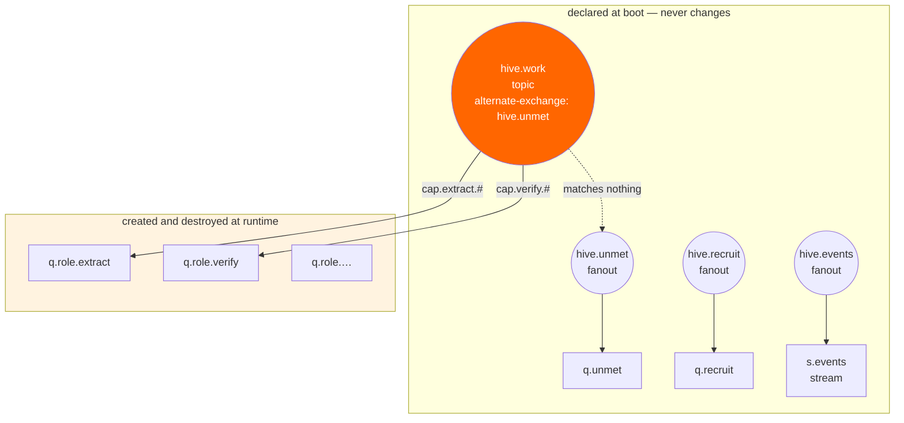
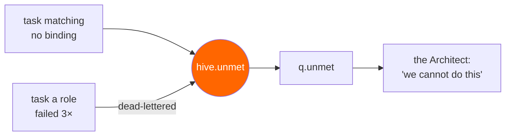

# 03 — Topology

The static skeleton HIVE boots with, and the rules governing everything it grows on top.

## Two layers



The fixed layer is four exchanges and three queues, declared once at bootstrap and never touched
again. Everything emergent lives in `q.role.*`, which is also exactly the namespace the Architect's
permissions allow it to touch.

**Bootstrap order is not optional.** `hive.unmet` must exist *before* `hive.work` names it as an
alternate exchange: if a configured AE does not exist, unroutable messages are discarded with only a
log warning. Silent loss of the colony's only sensory input, so the migration declares the AE first
and asserts its existence at startup.

## Capability routing keys

Routing keys name capabilities, hierarchically:

```
cap.<domain>.<action>[.<qualifier>]

cap.extract.pdf
cap.extract.html
cap.verify.claim
cap.cite.source
```

A role binds to the patterns it serves — `cap.extract.#` for anything extractive, `cap.verify.claim`
for one narrow thing.

The hierarchy is what makes **widening cheaper than specialising**. A role serving `cap.extract.pdf`
that keeps seeing unmet `cap.extract.html` can add one binding, which is a single Raft write. Creating
a new role is a queue, bindings, a worker and permanent topology cost. [02](02-morphogenesis.md)
requires the Architect to try widening first, and this key structure is what makes that possible.

The consequence worth stating: **routing is capability matching, done by the broker.** Most agent
frameworks spend an LLM call per task deciding who should handle it. Here a topic exchange does it in
microseconds, and the routing table doubles as the colony's model of its own competence.

## The fixed layer

```
hive.work      topic    durable   alternate-exchange: hive.unmet
hive.unmet     fanout   durable
hive.recruit   fanout   durable
hive.events    fanout   durable

q.unmet        quorum   durable   the evidence the Architect reasons over
q.recruit      quorum   durable   the job market
s.events       stream             x-max-age: 7D
```

`q.unmet` is a quorum queue because it is the colony's memory of its own failures — losing it means
losing the reason every future role exists.

`s.events` is a **stream**, not a queue, because its consumers are readers of history rather than
workers: every structural change is appended, and the UI replays the evolution of the architecture
from any `x-stream-offset` (`first`, a numeric offset, or a timestamp). Retention is time-based via
`x-max-age`; `x-max-length-bytes` is the size backstop.

## Role queues

Every emergent queue is declared with the same shape:

```
q.role.<name>     quorum   durable
  x-expires:        1800000      # 30 min unused → the broker deletes it
  x-dead-letter-exchange: hive.unmet
  delivery-limit:   3
```

Three arguments, three distinct jobs:

**`x-expires` is mortality.** A queue unused for the window is deleted by the broker with no
supervisory code. The subtlety from [02](02-morphogenesis.md) bears repeating because it decides
whether any of this works: **a queue counts as *used* while it has an online consumer.** The cell
must release the role and disconnect before the expiry clock starts. Cell first, queue second.

**`delivery-limit: 3` bounds failure.** A task that genuinely fails three times stops being retried.

**The dead-letter exchange is `hive.unmet`, and that is the elegant part.** A task that a role
repeatedly fails at is routed back into the colony's evidence pool — indistinguishable, to the
Architect, from a task nothing could route in the first place. Both mean *"the colony cannot currently
do this."*



So the colony learns from **failure to route** and **failure to execute** through one channel. A role
that exists but is bad at its job produces exactly the same pressure as a role that does not exist —
which is how a wrongly-designed role gets corrected rather than quietly underperforming forever.

### Retries versus poison, on 4.3

RabbitMQ 4.3 tracks two counters: `acquired-count` increments on every requeue, while
`delivery-count` increments only on a *failed* attempt — and `delivery-limit` watches `delivery-count`.

That distinction is load-bearing here. A cell that returns a task because it was rate-limited, or
because it is releasing its role, has not failed at anything, and must not push the task toward the
dead-letter exchange. Under a single counter, an afternoon of LLM rate limits would dead-letter a
queue of good work and the Architect would read it as a capability collapse — inventing roles to
solve a problem that was never structural.

So: transient trouble is `nack(requeue=true)`; genuine failure is `reject(requeue=false)`. Getting
that wrong does not merely lose tasks — it **corrupts the colony's model of itself**.

## Containing an agent that can rewrite the broker

The Architect declares and deletes broker objects on its own judgement, informed by task content
written by users. That is a prompt-injection target with unusually direct consequences, and a prompt
saying *"only create queues starting with q.role."* is not containment.

**The broker enforces it.** RabbitMQ permissions are regexes over resource names, per user, per vhost:

```
rabbitmqctl set_permissions -p hive hive_architect \
  "^(hive\.|q\.role\.|q\.unmet$|q\.recruit$|s\.events$)" \
  "^(hive\.|q\.role\.)" \
  "^(hive\.|q\.role\.|q\.unmet$|q\.recruit$|s\.events$)"
```

| User | configure | Can it restructure? |
|---|---|---|
| `hive_architect` | `^(hive\.\|q\.role\.\|…)` | Yes, inside that namespace only |
| `hive_cell` | `^$` — **nothing** | No. Cells consume and publish; they cannot declare |
| `hive_api` | `^$` | No |

A cell with a `configure` regex of `^$` cannot create or delete a single broker object, whatever its
prompt is talked into. Only the Architect can restructure, only within `hive.` and `q.role.`, and
never outside the vhost.

This is the difference between a demo and something defensible: **the blast radius is a broker ACL,
not a sentence in a system prompt.**

Additional limits, from [02](02-morphogenesis.md), enforced in the Architect itself: a morphogenesis
budget of 6 changes/minute, a 32-role cap, and a 10-minute per-capability cooldown.

## Living with Khepri

In 4.3, Khepri is the only metadata store. It is Raft-based, so exchanges, queues and bindings are
replicated cluster state and **every declaration is a consensus write**. Two documented consequences
shape this design:

- **Bulk deletion of many queues and bindings is slow.** So HIVE never culls. `x-expires` retires
  roles one at a time, on their own schedule, which is the gentlest possible deletion pattern.
- **Freshly declared topology needs a moment to settle** — RabbitMQ's guidance suggests 1–2 seconds
  before relying on it. Hence the curing step, which verifies through the management API rather than
  sleeping and hoping.

And the honest framing, repeated here because this is the document where a RabbitMQ engineer will
look for it: their guidance says applications with dynamic topologies should prefer a **static** set
of exchanges and bindings. HIVE's claim is not that this is wrong, but that the *rate* is what makes
it wrong — a handful of structural changes per minute against a workload of thousands of messages is
a different thing from per-message churn. [06 — Experiments](06-experiments.md) measures the cost
instead of asserting it is acceptable.

## Configuration

| Var | Used by | Purpose |
|---|---|---|
| `AMQP_URL` | architect, cell, api | Per-role credentials — each service gets its own user |
| `RABBITMQ_MGMT_URL` | architect, api | Binding verification during curing; topology for the UI |
| `ROLE_IDLE_MS` | cell | How long a cell waits on an empty queue before releasing the role |
| `QUEUE_EXPIRES_MS` | architect | `x-expires` on role queues. Default `1800000` |
| `MORPH_BUDGET_PER_MIN` | architect | Default `6` |
| `MAX_ROLES` | architect | Default `32` |
| `GAP_THRESHOLD` | architect | Unmet occurrences before a proposal. Default `5` |
| `OPENAI_API_KEY` | architect, cell | The only secret that leaves the machine |
| `OPENAI_BASE_URL` | architect, cell | Optional; any OpenAI-compatible endpoint |
| `LLM_MODEL` | architect | Role design. Default `gpt-5.6-terra` |
| `LLM_MODEL_FAST` | architect, cell | Clustering, capability tagging. Default `gpt-5.6-luna` |
| `NEXT_PUBLIC_API_URL` | web | `http://localhost:8000` |

**The browser gets no credentials.** `OPENAI_API_KEY` and every AMQP credential exist only in
server-side containers; the UI reads topology through the API. **No `NEXT_PUBLIC_*` variable carries
an OpenAI or AMQP credential** — if one appears in a diff, that is the bug.
