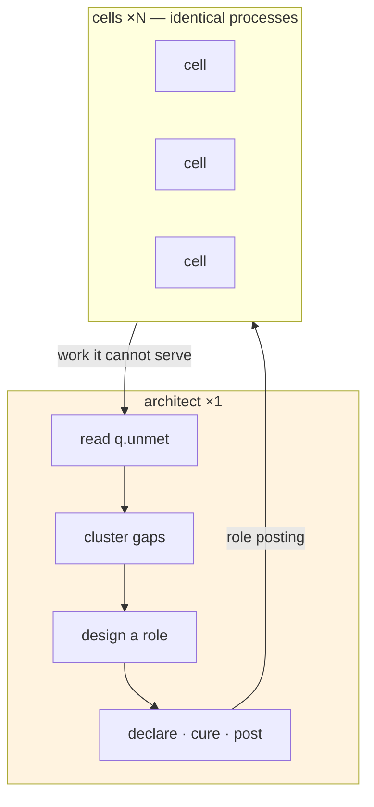
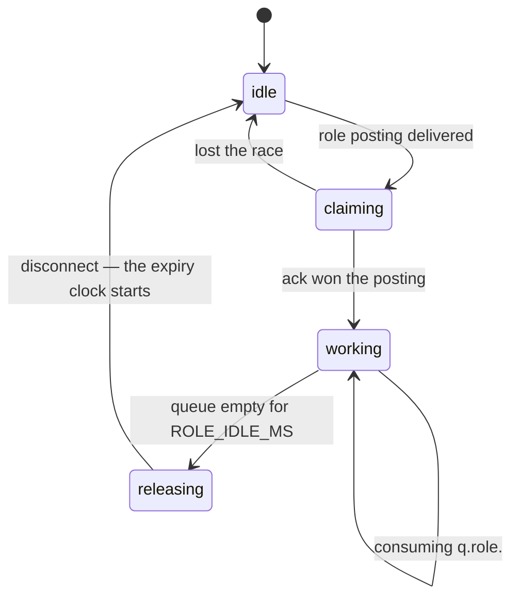
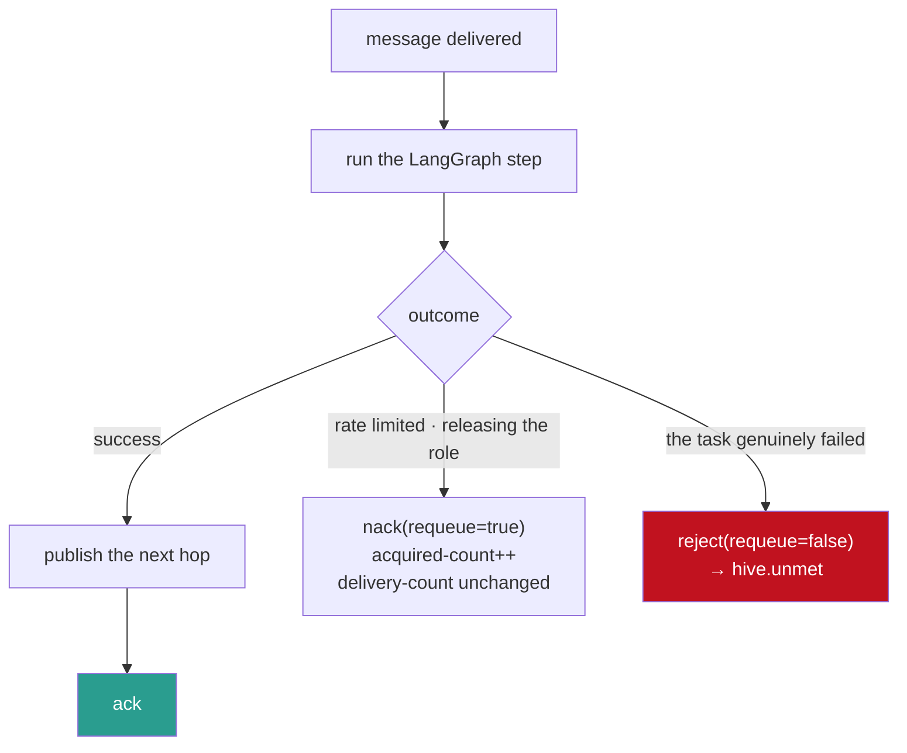

# 04 — Agents

Two kinds of process, and one of them is a costume rack.



The feedback loop is the system: cells fail at things, the Architect notices, cells become the thing
that was missing.

---

## The Architect

**One instance. The only process with topology authority.** Singleton not for correctness — the
budget and role cap would survive concurrency — but because structural decisions made by two
independent designers who cannot see each other's proposals produce a duplicated, incoherent org
chart. One designer, one coherent structure.

If it dies, the colony keeps working. Nothing routes through the Architect; it only *changes* things.
A colony without one is simply a colony that has stopped learning, which is a degraded state rather
than an outage.

### The loop

```python
async for evidence in unmet_queue:              # q.unmet, one at a time
    gaps.record(evidence)                        # accumulate; do not react

    for gap in gaps.recurring(threshold=GAP_THRESHOLD, window="10m"):
        if existing := can_widen(gap):           # cheapest fix first
            await widen_binding(existing, gap.pattern)
            continue

        if not budget.can_spend() or roles.count() >= MAX_ROLES:
            continue                             # the gap keeps its evidence

        role = await design_role(gap)            # LLM_MODEL
        await declare(role)
        await cure(role)                         # verify via management API
        await post(role)                         # hive.recruit
```

Three details in that loop are the whole discipline from [02 — Morphogenesis](02-morphogenesis.md):

- **`gaps.record` before any reaction.** Structure never moves on a single event.
- **`can_widen` before `design_role`.** One binding is a single Raft write; a role is permanent
  topology. The cheap fix is always tried first.
- **`continue`, not an error, when the budget is spent.** The gap keeps accumulating evidence and is
  reconsidered next minute. Backpressure on structural change, not failure.

### Designing a role

`LLM_MODEL` (`gpt-5.6-terra`), once per proposal — rare, and quality matters more than cost:

```python
class RoleDesign(BaseModel):
    name:         str        # → q.role.<name>, must match ^[a-z][a-z0-9_]{2,20}$
    capabilities: list[str]  # binding patterns, e.g. ["cap.verify.#"]
    prompt:       str        # the cell's system prompt
    rationale:    str        # why this role should exist — shown in the UI

designer = llm.with_structured_output(RoleDesign)
```

**`rationale` is not decoration.** It is what makes an emergent architecture auditable: every role in
the topology can answer *why do you exist?* in a sentence a human can disagree with. An org chart
nobody drew is only defensible if each box explains itself.

`name` is regex-validated **before** it reaches the broker. It becomes a queue name inside a
permission regex, and an LLM choosing resource names is an obvious injection surface — the model
proposes, the code validates, the broker's ACL is the backstop. Three layers, because the first is
the least trustworthy.

Clustering unmet tasks into candidate gaps runs on `LLM_MODEL_FAST` (`gpt-5.6-luna`): high volume,
narrow judgement, and the recurrence threshold already filters the noise.

---

## Cells

**Every cell is the same image and the same code.** A role is configuration a cell adopts at runtime,
which is what allows `--scale cell=20` to be a deployment decision instead of an architectural one.



### Claiming

`hive.recruit` is a fanout with competing consumers: the posting reaches every idle cell, and the
first to ack takes the job. No registry, no coordinator, no leader election — the broker's delivery
semantics do the allocation.

### Working

The cell consumes `q.role.<name>` with `PREFETCH=1`. One unacked message per cell, because agent
steps take seconds to minutes: a cell holding ten prefetched tasks has claimed nine it will not start
for several minutes, and if it dies, all ten are redelivered instead of one.

**LangGraph runs here**, inside the cell, for this role's own reason → act → observe loop. That loop
is tight, stateful and in-process, which is exactly what LangGraph is for. Everything *between*
cells — the handoff, the capability match, the structure — is RabbitMQ.

> LangGraph inside a role. RabbitMQ between roles.

### Releasing — and why the order matters

When `q.role.<name>` has been empty for `ROLE_IDLE_MS`, the cell cancels its consumer, **disconnects**,
and returns to the pool.

The disconnect is the point. `x-expires` only counts a queue as unused when it has **no online
consumers**, so a cell that politely idles on an empty queue keeps that role alive forever and the
colony can never shrink. The cell leaves, *then* the broker's clock starts, *then* the queue is
deleted. Cell first, queue second — get it backwards and roles are immortal.

### Ack discipline



**Ack after publishing the next hop, never before.** Ack first and a crash in between loses the work
silently — the broker believes it is done and nobody holds it. Publish first and a crash means
redelivery and a duplicate publish, which idempotency covers. One order is recoverable; the other is
not.

**The two nack paths are not interchangeable**, and the consequence here is worse than lost work.
`reject(requeue=false)` dead-letters to `hive.unmet` — the colony's evidence pool. Misclassifying a
rate limit as a failure does not just retry wrongly; it tells the Architect the colony *cannot do
this*, and it will start designing roles to solve a problem that was never structural. Bad ack
discipline corrupts the colony's model of itself.

### Idempotency

At-least-once delivery, so a cell may see a message twice — a crash after the LLM call but before the
ack has already done the work, and the broker cannot know.

> Key every side effect on `message_id` (`{run_id}:{step_id}`). Writing a result twice must be
> indistinguishable from writing it once.

Reads and LLM calls are safe to repeat; they cost money, not correctness. Writes and external calls
are not, and the agent author must make them idempotent. There is no framework magic here, and
[06 — Experiments](06-experiments.md) tests for duplicates explicitly because the failure is
otherwise silent.

### Consumer timeouts

RabbitMQ 4.3 enforces `consumer-timeout` on quorum queues, which is the right protection for a cell
stuck on a hanging tool call. The delivery mechanism matters: **on AMQP 0.9.1 the broker sends
`basic.cancel`** if the client advertises `consumer_cancel_notify`, and otherwise **closes the whole
channel**. So the cell must handle a cancellation it did not request, treat it as losing the message
rather than as an error, and re-establish cleanly. Not automatic, and worth handling before it
appears in a demo.

---

## Models

| Call site | Shape | Model |
|---|---|---|
| Role design | Rare, structured, quality-sensitive. Creates permanent topology | `LLM_MODEL` — `gpt-5.6-terra` |
| Gap clustering, capability tagging | High volume, narrow judgement | `LLM_MODEL_FAST` — `gpt-5.6-luna` |
| Cell reasoning | Per task, role prompt | `LLM_MODEL` |

```python
from langchain_openai import ChatOpenAI

llm      = ChatOpenAI(model=os.environ["LLM_MODEL"],      temperature=0.4)
llm_fast = ChatOpenAI(model=os.environ["LLM_MODEL_FAST"], temperature=0.0)
```

Role design runs warm on purpose (`temperature=0.4`). A colony that produces the identical org chart
every run is a hand-drawn graph with extra steps — the variation *is* the experiment in
[06](06-experiments.md).

`OPENAI_BASE_URL` points the same code at any OpenAI-compatible endpoint (Azure, LiteLLM, vLLM,
Ollama). The only hard requirement is structured-output support, which role design depends on.

## Client

`aio-pika` — AMQP 0.9.1, asyncio. Python has no mainstream AMQP 1.0 client (both `pika` and
`aio-pika` are 0.9.1), which costs one thing worth naming: the AMQP 1.0 per-message
`x-opt-delivery-time` backoff override is unavailable. HIVE uses the **policy** form of delayed retry
instead, which needs no application code at all and is the better story regardless.

Streams are consumable over AMQP 0.9.1 using the `x-stream-offset` consumer argument, so replay in
[05 — UI](05-ui.md) needs no second client library.

## Tests worth writing

Not a suite — the checks that catch the failures that would otherwise be invisible:

1. **Gap threshold.** Four occurrences create nothing; the fifth proposes. Structure must not react
   to noise.
2. **Widen before create.** A gap an existing role could serve produces a binding change, not a role.
3. **Budget exhaustion.** Over-budget proposals queue and are reconsidered — never dropped, never
   erroring.
4. **Cure race.** Publishing before a binding is verified must not be possible. This is the
   self-inflicted loop from [02](02-morphogenesis.md), and it looks like emergence when it happens.
5. **Release ordering.** Assert the cell disconnects *before* the expiry window is expected to start.
6. **Nack classification.** A simulated 429 must not increment `delivery-count` or reach
   `hive.unmet`.
7. **Name validation.** An adversarial `RoleDesign.name` (`../`, `hive.work`, 200 characters) is
   rejected before it reaches the broker.
