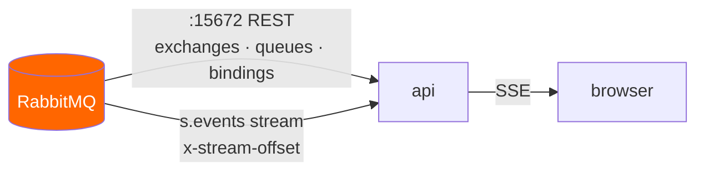
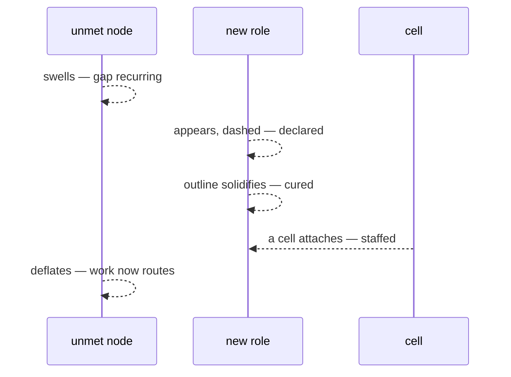
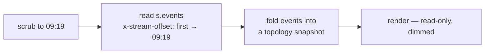

# 05 — UI

The demo is watching an architecture design itself. The UI has one job: make that legible while it
happens, and replayable afterwards.

## Layout

```
┌──────────────────────────────────────────────────────────────┐
│  HIVE          7 roles · 3 idle cells · budget 4/6      ⚙    │
├───────────────────────────────────────┬──────────────────────┤
│                                       │  extract_pdf         │
│         ○ extract_pdf ─────┐          │  born  09:14         │
│                            │          │  age   11m           │
│    ○ verify_claim ─────────●          │  ───────────────     │
│                       hive.work       │  "Six tasks needed   │
│         ○ cite_source ─────┘          │   text out of PDFs   │
│                            ╲          │   and no role could  │
│                             ╲         │   read binary. Split │
│                          ◌ unmet      │   from summarise so  │
│                                       │   it can scale."     │
│         ◍ reconcile  (curing)         │  ───────────────     │
│                                       │  1 cell · 42 done    │
│                                       │  cap.extract.#       │
├───────────────────────────────────────┴──────────────────────┤
│  ◀━━━━━━━●━━━━━━━━━━━━━━━━━━━━━━━━━━━━━━━━━━▶  09:26  [live] │
└──────────────────────────────────────────────────────────────┘
```

Left: the live topology. Right: the dossier of whatever is selected. Bottom: the morphogenesis
scrubber.

## Where the picture comes from



Two sources, deliberately different in kind:

- **The management API is the truth about *shape*.** Not a model of the topology, not a projection —
  the actual exchanges, queues and bindings. If a queue is on screen, it exists in the broker; if the
  Architect declared something the UI does not know about, the next poll shows it. The system cannot
  lie about its own structure, because the picture is read from the thing itself.
- **`s.events` is the truth about *history*.** Every structural change is appended, so the timeline
  replays from any `x-stream-offset`.

**The browser holds no AMQP connection and no credentials.** It talks to the API over SSE, and the
API holds the broker connections. Management polling is coalesced server-side: one poll feeding many
viewers, not one per tab.

Polling cadence matches the two clocks from [02](02-morphogenesis.md) — topology every few seconds,
because structure changes in minutes; queue depths and rates faster, because that is the fast loop.

## The topology view

A force-directed graph of the real topology. `hive.work` at the centre, roles orbiting, bindings as
edges labelled with capability patterns.

| Encoding | Meaning |
|---|---|
| Node size | Messages processed, all time |
| Ring thickness | Cells currently staffing the role |
| Fill opacity | Recency of work — a fading node is heading toward expiry |
| Dashed outline | **Curing** — declared, not yet verified, nothing routes here |
| Edge thickness | Message rate on that binding |
| Red halo | Queue depth rising faster than it drains — understaffed |
| The `unmet` node | Always present. It grows when the colony is failing |

Showing curing as a distinct state matters: it is the only moment when the topology contains
something that exists but does not work, and hiding it would make the following seconds look like a
bug.

**`unmet` is deliberately permanent on screen.** It is the colony's ignorance, and watching it swell
before a new role appears — then deflate — is the clearest available picture of the whole feedback
loop.

### The five seconds worth animating

Almost everything else can be a state change. This one is the demo:



Node appears, edge draws itself, the unmet node shrinks. Nobody clicked anything. That is the
screenshot the project exists to produce.

## Role dossiers

Click a role and get the case for its existence:

| Field | Source |
|---|---|
| **Rationale** | The Architect's written justification from `RoleDesign.rationale` |
| **Evidence** | The unmet tasks that triggered it — the actual messages |
| **Born / age** | From `s.events` |
| **Capabilities** | Its live bindings, read from the management API |
| **Throughput** | Messages processed, current depth, staffing |
| **Cost** | Tokens spent by cells wearing this role |
| **Fate** | Still live, or expired at — and what it did last |

The rationale is what makes an emergent architecture auditable rather than mystical. Every box can
answer *why do you exist?* in a sentence a human is free to disagree with — and the evidence list
means the disagreement can be checked against what actually happened.

**Dead roles stay browsable.** The queue is gone from the broker, but the stream remembers it. A role
that lived nine minutes and handled four tasks is one of the more interesting objects in the system,
and a UI that only shows the present would throw that away.

## The morphogenesis scrubber

Drag the timeline and the topology snaps to its shape at that moment, rebuilt by replaying `s.events`
from the start up to the chosen offset.



Read-only and visibly so, because a UI that lets you edit the past will be asked to.

Snapshots are folded from the event log rather than stored, so the replay is exactly the history the
broker recorded. Cached per offset; dragging is not one full replay per frame.

Playing it at speed is the single best artefact this project produces: eleven minutes of an
architecture assembling itself, in fifteen seconds, with the reasons attached.

## Deliberately not built

- **No topology editor.** The moment a human can drag a binding, the claim "nobody drew this" is
  dead. Roles are born from evidence or not at all.
- **No manual role creation button**, for the same reason.
- **No chat pane.** The colony is not a chatbot; the interface is the goal in, the architecture out.
- **A kill switch** — debug builds only — that force-deletes a role, to demonstrate that the colony
  regrows it if the work keeps arriving. This is the one destructive control worth having, because it
  proves the loop closes.

## Stack

Next.js App Router, SSE from the API, `react-force-graph-2d` for the topology. No design system, no
theming.

Performance notes that matter at 32 roles: diff topology snapshots and mutate the existing graph
rather than replacing the node array, or the force layout re-seeds and every node jumps on each poll —
which reads as chaos rather than growth. Preserve node identity across polls; that continuity is what
makes the structure look like it is *growing* instead of being redrawn.
