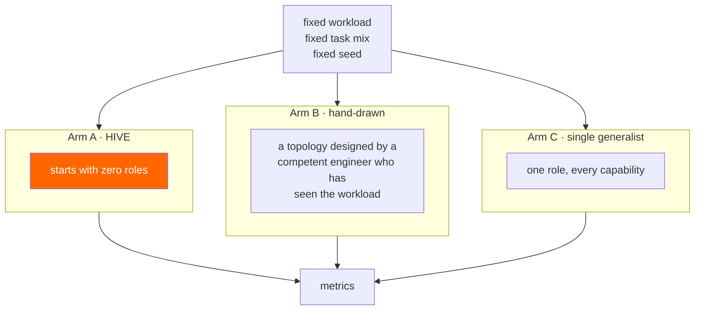

# 06 — Experiments

This document defines the method. **The result tables are intentionally empty** — they get filled
after implementation, with whatever the numbers turn out to be.

That is not modesty. HIVE's premise is that a structure discovered from the workload beats one
guessed at up front. That premise might be wrong. An experiment designed to confirm it would be worth
nothing to a reader deciding whether any of this is real, so if the hand-drawn baseline wins, it wins
in the table below with a note on why.

## The questions

1. **Does emergence beat a competent human design?** Against a fixed workload, does the colony's
   discovered topology outperform one an experienced engineer drew in advance?
2. **What does thinking about itself cost?** Tokens and latency spent designing roles produce nothing
   for the user. How much of the budget goes to introspection?
3. **Is the churn acceptable to the broker?** RabbitMQ's guidance prefers static topologies. What
   does HIVE's rate actually do to Khepri?
4. **Does it converge?** Two runs of the same workload — same shape, or different every time?
5. **Where is the volume floor?** Below what throughput does a gap never recur, leaving the colony
   unable to grow?

Question 3 is the one the RabbitMQ team will care about most, and it is the one this project has the
least right to hand-wave.

## The arms



**Arm B is the honest opponent.** It is drawn by someone who has *already read the task mix* — the
best case for up-front design, not a strawman. If HIVE cannot beat a good guess, that is the finding.

**Arm C is the floor.** One agent doing everything, no specialisation. It exists because a
surprisingly large fraction of the value in multi-agent systems turns out to be specialisation
itself, and if Arm C is competitive then both other arms are elaborate machinery for nothing. That
possibility deserves a place in the table.

All three arms run the same tasks in the same order with the same seed, against the same models, on
the same machine.

## Metrics

| # | Metric | How measured | Why |
|---|---|---|---|
| 1 | Task success rate | Fixed rubric, graded per task | The only outcome that matters |
| 2 | Tokens per completed task | Summed across all agents | The real cost |
| 3 | **Introspection overhead** | Tokens spent clustering + designing ÷ total | What emergence costs |
| 4 | Time to competence | First unmet occurrence → live role serving it | How slow learning is |
| 5 | Unmet ratio over time | `q.unmet` arrivals ÷ tasks, per minute | Should fall. If it does not, the colony is not learning |
| 6 | Final role count | Live roles at end | Compared against Arm B's hand-drawn count |
| 7 | Structural changes | Declarations + deletions + binding changes | Input to metric 8 |
| 8 | **Khepri churn cost** | Metadata store latency and memory during the run | The broker-health question |
| 9 | Duplicate side effects | Idempotency-key collisions producing divergent writes | At-least-once, verified rather than assumed |
| 10 | Structural similarity across runs | Graph edit distance between two runs of Arm A | Convergence or chaos |

Metric 3 is the guard rail. HIVE could win metric 1 by spending twice the tokens on self-analysis,
which would be a real result and a bad product — reporting 1 without 3 would be dishonest.

Metric 5 is the clearest single picture of whether any of this works. A colony that is learning has a
falling unmet ratio; a flat line means the feedback loop is decorative.

## The Khepri experiment

Question 3 deserves its own method, because it is where HIVE contradicts RabbitMQ's own advice.

Measured throughout the run:

- Metadata store operation latency, p50 / p95 / p99, during structural change versus at rest.
- Broker memory attributable to the metadata store, sampled over the run — the historical binding
  churn concern.
- Time to declare and cure a role, as observed by the Architect.
- Whether any binding fails to propagate within the curing window, and how often curing has to retry.

Run at three morphogenesis budgets — **2, 6 and 20 changes per minute** — against an identical
workload:

```
Budget (changes/min) | Metadata p95 (ms) | Broker RSS Δ (MB) | Cure retries | Task success
---------------------|-------------------|-------------------|--------------|-------------
2                    |                   |                   |              |
6  (default)         |                   |                   |              |
20                   |                   |                   |              |
```

This table is the project's core technical claim stated as a measurement: **there exists a rate at
which dynamic topology is fine, and HIVE runs below it.** If the numbers say otherwise — if 6/min
already degrades the broker — then the default is wrong and the docs change to say so. That result
would be worth publishing precisely because nobody has measured it for this pattern.

## Workload

- **Volume:** 2000 tasks. Enough that gaps recur, which is the floor the design needs.
- **Mix:** eight capability classes, deliberately imbalanced — two dominant, four moderate, two rare.
  A uniform mix would flatter emergence by making every gap equally obvious.
- **Drift:** the mix **changes halfway through**. Two new capability classes appear; two disappear.

The drift is the whole point. A static topology cannot respond to it, and this is the one condition
under which emergence should be clearly better. If HIVE does not win *here*, it does not win
anywhere — so the experiment is built to give the hypothesis its best shot and to say so openly,
rather than burying an advantage in an averaged number.

Reported separately for the pre-drift and post-drift halves, because a single average would hide
exactly the effect being tested.

## Result tables — to be filled

### Outcome

```
Metric                        | HIVE | Hand-drawn | Single generalist
------------------------------|------|------------|------------------
Task success rate             |      |            |
Tokens per completed task     |      |            |
Success, post-drift half      |      |            |
Final role count              |      |     (fixed)|        1
```

### Emergence cost

```
Metric                             | HIVE
-----------------------------------|------
Introspection tokens (% of total)  |
Time to competence, median (s)     |
Unmet ratio, first quarter         |
Unmet ratio, final quarter         |
Structural changes, total          |
```

### Convergence

```
Run pair | Graph edit distance | Shared roles | Roles unique to one run
---------|---------------------|--------------|-----------------------
A1 vs A2 |                     |              |
A1 vs A3 |                     |              |
A2 vs A3 |                     |              |
```

## Honesty rules

Committed to before any number exists:

1. **Every metric measured is published**, including the ones where the hand-drawn baseline wins.
2. **No baseline sandbagging.** Arm B is designed by someone who has seen the workload, and the time
   spent designing it is recorded.
3. **The drift is disclosed, not exploited.** Pre- and post-drift results are reported separately,
   because the drift is where HIVE is expected to win.
4. **Reproducible or retracted.** If `make experiment` does not reproduce a number within variance on
   another machine, the number comes out.
5. **Scope stated plainly.** One workload shape, one model pair, single node, one machine. This is
   not a claim about multi-agent systems in general and will not be described as one.
6. **Non-determinism is reported, not averaged away.** Three runs of Arm A, all three reported. If
   the variance is large, that *is* the result, and it is the strongest argument against deploying
   this.

Rule 6 is the one most likely to hurt. Emergent structure is non-deterministic by construction, and a
system that produces a different architecture every run is a hard thing to operate. Publishing the
variance honestly is more useful to a reader than the best of three, and more useful to this project
than a favourable number that does not survive scrutiny.

## What would falsify this

Stated up front so the experiment cannot be quietly rewritten afterwards:

- Arm B matches HIVE **after** the drift → up-front design is sufficient, and the whole premise is
  wrong.
- Arm C is competitive with both → the specialisation this project arranges was never worth arranging.
- Introspection overhead exceeds ~25% of tokens → the structure costs more than it saves.
- The unmet ratio does not fall → the loop is not learning, whatever the topology looks like.
- Metadata p95 degrades at 6 changes/minute → the default rate is unsafe and the design needs a
  slower clock, or is not viable on a cluster.

Any one of these belongs in the README.
