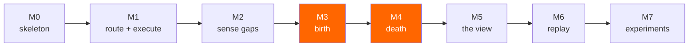

# 07 — Roadmap

Eight milestones. Each one runs and shows something on its own.

M3 and M4 are the project — birth and death are the loop. M0–M2 exist to reach them; M5–M6 make them
visible; M7 asks whether any of it was worth doing.

---

## M0 — Skeleton

The static layer from [03 — Topology](03-topology.md), and nothing that moves.

- `docker-compose.yml` — RabbitMQ **4.3+** with the management plugin.
- `definitions.json` — the four exchanges, `q.unmet`, `q.recruit`, `s.events`. **`hive.unmet`
  declared before `hive.work` references it as an alternate exchange.**
- Three users with regex-scoped permissions; `hive_cell` and `hive_api` get `configure` of `^$`.
- Health check that asserts the AE exists.

**Done when:** publish a message with a routing key nothing binds to, and find it in `q.unmet`.

> That one check is the foundation of everything. If unroutable messages are not landing in
> `q.unmet`, the colony is blind and every later milestone is built on nothing. A missing AE
> discards messages with only a log warning, so this must be *verified*, not assumed.

---

## M1 — Route and execute

Cells that work, with roles created by hand.

- Cell process: claim from `hive.recruit`, consume `q.role.<name>`, run a LangGraph step, publish,
  ack.
- Ack discipline from [04 — Agents](04-agents.md): publish then ack; nack classification split from
  reject.
- Two hand-declared roles.

**Done when:** tasks flow through two roles end to end, and `docker kill` on a cell mid-task results
in redelivery rather than loss.

---

## M2 — Sense

The Architect observes and proposes, but changes nothing.

- Consume `q.unmet`, cluster gaps (`LLM_MODEL_FAST`), accumulate against the recurrence threshold.
- Log proposals — **do not act on them.**
- Dead-letter wiring so execution failures land in `q.unmet` alongside routing failures.

**Done when:** feeding the colony work it cannot serve produces a proposal in the log after the fifth
occurrence and not before.

Keeping M2 read-only is deliberate. It lets you tune the threshold and see the proposals a real
workload generates before granting anything the power to act on them.

---

## M3 — Birth

The Architect gains topology authority.

- `design_role` (`LLM_MODEL`, structured output) with **regex name validation before the broker sees
  it.**
- `can_widen` tried first — a binding change beats a new role.
- Budget, role cap, per-capability cooldown.
- Declare → **cure** (verify via the management API) → post to `hive.recruit`.

**Done when:** a capability the colony lacks produces a live, staffed role that serves it — with no
human involved. And the cure test from [04](04-agents.md) passes: nothing publishes to an unverified
binding.

> The cure race is the bug that will bite here. Publish to a binding that has not propagated, the
> message falls through to `q.unmet`, the Architect reads it as another gap, and proposes the role it
> just built. It looks like emergence. It is a race.

---

## M4 — Death

The colony shrinks.

- `x-expires` on role queues.
- Cells release a role after `ROLE_IDLE_MS` and **disconnect** — cell first, queue second.
- Structural events published to `s.events`.

**Done when:** stop sending a class of work, and the role's cell leaves, the queue expires, and the
topology is smaller. Then send that work again and watch the colony regrow it.

The regrowth is the better demo. Shrinking could be a leak; shrinking and regrowing on demand is the
loop closing.

---

## M5 — The view

- Management API polling, coalesced server-side; SSE to the browser.
- Force graph with the encoding from [05 — UI](05-ui.md), **including the dashed curing state**.
- Role dossiers with rationale and the triggering evidence.
- Node identity preserved across polls, or the layout re-seeds and growth looks like chaos.

**Done when:** you can watch a full birth — unmet swells, node appears dashed, solidifies, a cell
attaches, unmet deflates — without reading a log.

---

## M6 — Replay

- Read `s.events` with `x-stream-offset`; fold events into topology snapshots.
- Scrubber, cached per offset, read-only and visibly so.

**Done when:** an eleven-minute run replays in fifteen seconds and the architecture assembles itself
on screen.

---

## M7 — Experiments

[06 — Experiments](06-experiments.md), executed.

- Workload generator: 2000 tasks, eight capability classes, **the mid-run drift**.
- Arm B (hand-drawn, by someone who has seen the mix) and Arm C (single generalist).
- The Khepri experiment at budgets 2 / 6 / 20.
- Fill every table, including the unflattering ones. Apply the honesty rules.
- README, demo video, and the falsification list from `06` — whichever items came true.

**Done when:** someone clones the repo, runs `docker compose up`, gives it a goal, and watches an
architecture build itself. And the numbers are in the docs whether or not they flatter the idea.

---

## Sequencing notes

- **M2 before M3, always.** Granting an LLM authority to declare broker objects before you have
  watched a week of its proposals is how this becomes a cautionary tale.
- **M4 is not optional polish.** A colony that only grows hits its role cap and stops. Birth without
  death is a leak with good PR.
- **Build a crude version of M5's event log during M2.** Debugging emergence without visibility is
  miserable, and the log is cheap.
- **The Khepri measurement can start at M3**, as soon as anything churns. Finding a problem at M7,
  after the design is set, is finding it too late.

## Stretch, after M7

- **Role merging.** Two roles with overlapping capabilities and low individual throughput get
  consolidated. Currently the colony can only specialise, never simplify — and an org chart that can
  only grow is only half a metaphor.
- **Cross-run memory.** Seed a colony from a previous run's structure. Does it converge faster, or
  does inherited structure prevent it from adapting?
- **Multi-node.** Everything here is single-node. Khepri is built for clusters, and the churn
  question gets more interesting when declarations replicate across three nodes.
- **A capability marketplace.** Roles bid for work rather than binding statically to patterns —
  priority as currency.
