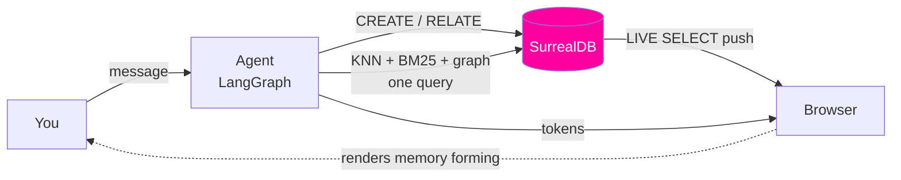

# CORTEX

**Watch an AI mind form.**

CORTEX is an AI agent whose memory *is* a database — not a vector store bolted to a graph store
bolted to a search index. One engine. One query language. One container.

The left half of the screen is a chat. The right half is the agent's memory, rendered as a graph
that grows and rewires **while you watch**. Not a refresh. Not a poll. The browser is subscribed to
the same records the agent writes, so a fact appears on screen at the moment it is learned.



The browser's memory feed does not go through the API. It comes straight off the database.
That is the whole point.

---

## The stack you don't need

A typical production agent-memory stack:

| Job | Usual tool |
|---|---|
| Semantic recall | Pinecone / pgvector |
| Associative memory | Neo4j |
| Keyword recall | Elasticsearch |
| Conversation state | Postgres |
| Live updates to the UI | Redis pub/sub + a websocket service |

CORTEX runs all five on **SurrealDB alone**. The UI keeps a counter in the corner that reads
`1 database` — next to the 5 it replaces. Every retrieval is inspectable: click a glowing node and
the exact SurrealQL that surfaced it opens in a panel.

---

## What you actually see

| The agent does this | The screen does this | The database feature doing it |
|---|---|---|
| Extracts a fact from your message | A node pops into the graph | `CREATE` + `LIVE SELECT` |
| Links it to something already known | An edge draws itself between two nodes | `RELATE a->relates->b` |
| Recalls semantically | Candidates glow, brightness = similarity | HNSW `<\|K,EF\|>` |
| Recalls by keyword | Candidates glow, brightness = BM25 rank | `FULLTEXT` index |
| Follows associations | The traversal path lights up hop by hop | `.{1..3}->relates->` |
| Learns a contradiction | The old fact dims; the new one supersedes it | `supersedes` edge + temporal fields |
| Forgets | A node fades out | ASYNC table event |

Nothing is ever deleted. Ask *"why do you think that?"* and CORTEX walks the `derived_from` edges
back to the exact message you said it in.

---

## Quickstart

You need an [OpenAI API key](https://platform.openai.com/api-keys).

```bash
cp .env.example .env
# set OPENAI_API_KEY=sk-...
docker compose up
# open http://localhost:3000
```

Three containers: `surrealdb`, `api` (Python / FastAPI / LangGraph), `web` (Next.js).
A seeded memory is included so the graph is interesting on first load.

The key stays in the `api` container — the browser only ever gets a read-only SurrealDB token.
Default models are `gpt-5.6-terra` for reasoning, `gpt-5.6-luna` for the cheap consolidation checks,
and `text-embedding-3-small` for embeddings; a demo conversation costs a few cents. Point
`OPENAI_BASE_URL` at any OpenAI-compatible endpoint (LiteLLM, vLLM, Ollama) to run it locally
instead — see [04 — Agent](docs/04-agent.md).

---

## Design docs

| Doc | What's in it |
|---|---|
| [01 — Concept](docs/01-concept.md) | The agent-memory problem, and why one engine changes the shape of the solution |
| [02 — Architecture](docs/02-architecture.md) | Containers, data flow, auth, and the live-push path |
| [03 — Data model](docs/03-data-model.md) | The full SurrealQL schema, indexes, and the hybrid retrieval query |
| [04 — Agent](docs/04-agent.md) | The LangGraph node graph, memory tools, and the SurrealDB checkpointer |
| [05 — UI](docs/05-ui.md) | The live graph, its visual encoding, and the query inspector |
| [06 — Benchmark](docs/06-benchmark.md) | How we compare against the 5-database stack, honestly |
| [07 — Roadmap](docs/07-roadmap.md) | Build order, each milestone independently demoable |
| [08 — Testing](docs/08-testing.md) | The stress suite, what it proves, and the seven things it found |

---

## Status

**M0–M4 built and under test.** The schema and migration, the live memory graph,
and the LangGraph agent all run. Talk to it and the memory forms on screen: facts
are extracted atomically, entities linked, contradictions superseded rather than
deleted, and every recall recorded with the exact SurrealQL that produced it.
Conversation state is checkpointed into SurrealDB, so a restarted API resumes
mid-thread.

A stress suite covers it: **51 tests** against a simulated engineering
organisation of **721 entities, 3,439 facts and 11,316 edges** — zero torn reads
under 50 concurrent writers, a browser that reconverges after the database is
restarted underneath it, and a real two-turn conversation asserting that
contradicting a fact ends it without destroying it.

It found fourteen real problems, including a reproducible **SIGSEGV in SurrealDB
3.1.6** and five errors in these design docs. All are written up with their
reproductions in [08 — Testing](docs/08-testing.md).

Still to come: M5 (seed data, `web` in compose, a verified one-command
quickstart), M6's comparison stack, and M7.

Built on [SurrealDB 3.x](https://surrealdb.com/docs). `LIVE SELECT` is single-node only today, so
CORTEX is a single-node deployment — see [02 — Architecture](docs/02-architecture.md).
