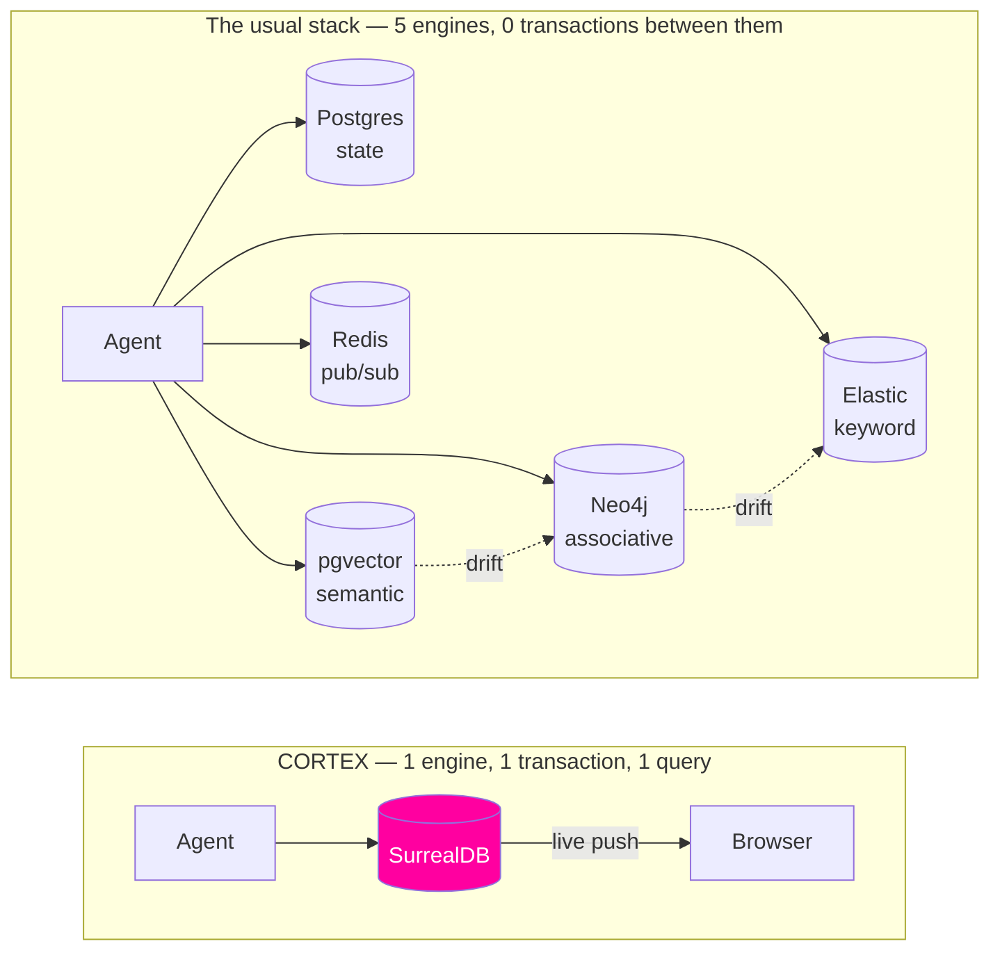

# 01 — Concept

## The problem

An agent with a context window and no memory is a goldfish with a vocabulary. The industry answer
has been RAG, and RAG in production has an unglamorous shape: you end up running several databases
that each know part of the truth and none of them agree.

Four failures show up over and over:

**Context rot.** Recall is top-k cosine similarity over chunks. The chunks that win are the ones
that *sound* like the question, not the ones that answer it. Nothing in a vector index knows that
two facts are about the same person.

**Stale facts.** Someone changes jobs. The old embedding is still in the index, still similar, still
retrievable. Most systems handle this by deleting — which destroys the history you needed to explain
the change.

**No provenance.** The agent asserts something. You ask where it got that. It cannot tell you,
because the chunk it retrieved has no edge back to the conversation that produced it.

**Split-brain infrastructure.** Vectors live in Pinecone, relationships in Neo4j, keywords in
Elasticsearch, state in Postgres. Writes are not transactional across them. They drift. The glue
code that keeps them roughly aligned becomes the largest and least loved part of the system.

## Why one engine changes the answer, not just the ops bill

Consolidating five databases into one is usually pitched as an operations win. It is a bigger deal
than that, because it makes queries possible that could not be written before.

In a split stack, "find things semantically similar to this, **then** walk two hops of association
from whatever you found, **then** rank the union against keyword relevance" is three round trips,
two network hops, and a pile of application code doing the join in Python. So nobody writes it. They
write top-k cosine and ship.

In SurrealDB it is one statement. Vector similarity, graph traversal, and BM25 compose in a single
query against a single transactional store — which means the retrieval quality argument and the
simplicity argument are the same argument. SurrealDB makes this case themselves in
[one query, not two stores](https://surrealdb.com/blog/one-query-not-two-stores-how-vector-graph-in-surrealdb-makes-agents-more-accurate);
CORTEX exists to make it *visible*.

## The seven behaviours

CORTEX implements seven memory behaviours. Each one is chosen because it is genuinely hard on a
split stack, and because it produces a moment you can see.

### 1. Encode
The agent reads your message and extracts discrete facts, each with a confidence and an embedding.

> **On screen:** nodes pop into the graph, one per fact, sized by confidence.

### 2. Associate
Each fact is linked to the entities it mentions, and entities to each other. The graph is built
incrementally, as a side effect of talking.

> **On screen:** edges draw themselves between the new node and what the agent already knew.

### 3. Recall — semantic
HNSW approximate nearest neighbour over fact embeddings.

> **On screen:** candidate nodes glow; brightness encodes similarity.

### 4. Recall — lexical
BM25-scored full-text search, because names, IDs, and exact phrases are where embeddings fail.

> **On screen:** a different glow colour, ranked by BM25 score.

### 5. Recall — associative
Recursive graph traversal outward from whatever the first two found. This is the step a vector store
structurally cannot do.

> **On screen:** the traversal path lights up hop by hop, so you can watch the agent free-associate.

### 6. Supersede
When new information contradicts old, the old fact is not deleted. It gets a `valid_to` timestamp
and a `supersedes` edge pointing from its replacement. The history stays queryable.

> **On screen:** the old node dims and drifts back; the new one takes its place, connected by a
> visibly different edge.

### 7. Decay
Facts that are never retrieved lose salience over time and eventually fall out of the working set —
still stored, no longer surfaced. Runs as an ASYNC table event, after commit, off the write path.

> **On screen:** nodes quietly fade.

Behaviours 6 and 7 are what make provenance work: ask *"why do you believe that?"* and CORTEX walks
`derived_from` edges back to the exact message, and `supersedes` edges back through everything it
used to believe instead.

## Why the SurrealDB team should care

They repositioned the company around agent memory and raised $23M on that thesis
([3.0 launch](https://surrealdb.com/blog/introducing-surrealdb-3-0--the-future-of-ai-agent-memory)).
The claim is that one engine replaces the five-database RAG stack. CORTEX is that claim as a running
program:

- **It proves the pitch instead of asserting it.** Five capabilities, one container, and a
  reproducible benchmark against the stack it replaces — including the numbers that don't flatter us.
- **It makes the invisible visible.** Every other agent-memory demo is a chat box; you take the
  memory on faith. Here the memory is the interface. That is a GIF, and GIFs travel.
- **It exercises 3.0 specifically.** `LIVE SELECT` driving the UI, concurrent-write HNSW, schema-level
  bidirectional links, computed fields, ASYNC events — and, as a stretch, a WASM extension running
  scoring logic inside SurrealQL.
- **It leaves reusable parts behind.** A LangGraph `BaseCheckpointSaver` backed by SurrealDB is worth
  publishing on its own; today LangGraph users reach for Postgres by default.

## Non-goals

- Not a general-purpose RAG framework. It is one opinionated memory design, built to be legible.
- Not multi-tenant or horizontally scaled. `LIVE SELECT` is single-node today and we say so.
- Not a model benchmark. The model is swappable and uninteresting; the memory layer is the subject.
