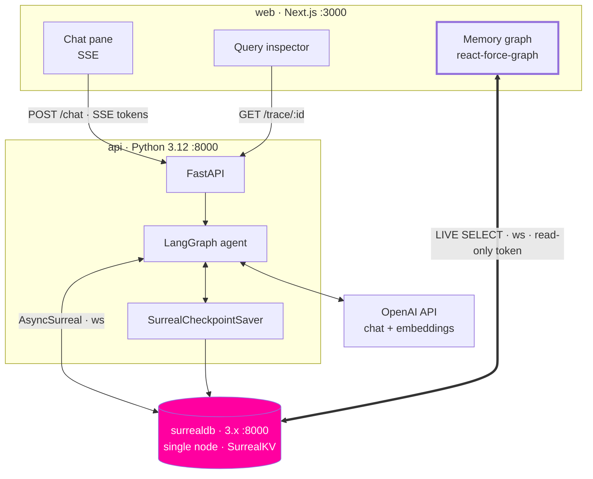
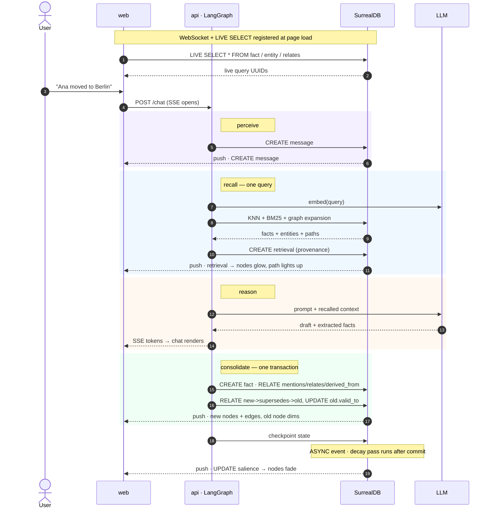
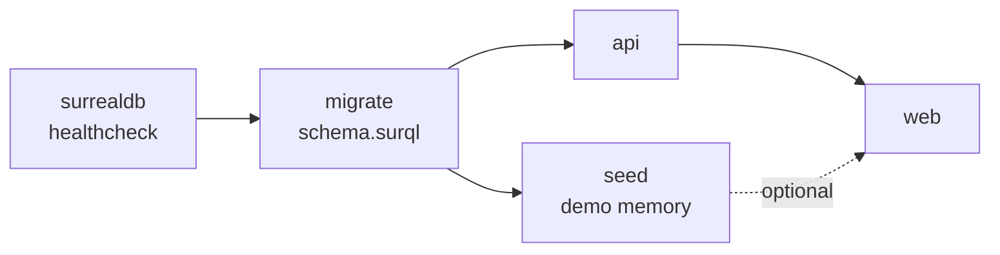

# 02 — Architecture

## Topology

Three containers. The unusual bit: the browser holds **two** connections — an HTTP/SSE connection to
the API for chat, and a **direct WebSocket to SurrealDB** for the memory feed.

The thick line is the demo. Memory updates reach the screen without passing through the API at all.

| Container | Image / base | Responsibility |
|---|---|---|
| `surrealdb` | `surrealdb/surrealdb:v3` | Everything stateful. Single node, RocksDB file backend, named volume. |
| `api` | `python:3.12-slim` | FastAPI, the LangGraph agent, embedding calls, trace endpoint. Stateless. |
| `web` | `node:22-alpine` | Next.js App Router, chat UI, live graph, inspector. Stateless. |

### Why single node

`LIVE SELECT` is **supported on single-node deployments only** today
([docs](https://surrealdb.com/docs/surrealql/statements/live)); multi-node is in development. CORTEX
is built directly on live queries, so it is a single-node system and the README says so. When
multi-node live queries land, the only change is the deployment topology.

### Why the browser talks to the database

It would be easy to proxy memory events through FastAPI over the same SSE stream. We don't, for
three reasons:

1. **It's the honest demo.** The claim is that the database pushes changes to subscribers. Routing
   through an application server would quietly re-introduce the pub/sub tier we're claiming to
   delete.
2. **It's less code.** No fan-out, no subscription registry, no reconnect logic in the API.
3. **It decouples the panes.** The graph keeps animating during a slow LLM call, because it isn't
   waiting on the agent's response — only on committed writes.

## A single turn, end to end

Steps 3–4 are the moment worth watching: the browser has already rendered the new memory before the
model has finished its sentence.

## Auth

The browser gets a **read-only** connection. Never a root credential.

- SurrealDB starts with a root user from Docker secrets/env, used only by `api` and by migrations.
- A database-level user with the `VIEWER` role exists for the UI:
  `DEFINE USER cortex_viewer ON DATABASE PASSWORD "..." ROLES VIEWER;`
- The browser calls `GET /viewer-token` on the API, which signs in as that viewer and returns a
  short-lived JWT. The browser authenticates its WebSocket with the token — it can `SELECT` and
  `LIVE SELECT`, and nothing else.
- Token refresh matters: **signin/signup invalidates live queries on that session**. The client must
  refresh *before* expiry and re-register subscriptions on reconnect. This is a real footgun; the UI
  reducer handles it explicitly (see [05 — UI](05-ui.md)).

Scoping to a session (so one browser doesn't see another's memory) is done with `WHERE` clauses on
the live queries plus record-level `PERMISSIONS` on the tables. For the single-user demo deployment
this is defence in depth, not the primary boundary.

## Configuration

All via environment, no config files:

| Var | Used by | Purpose |
|---|---|---|
| `SURREAL_URL` | api | `ws://surrealdb:8000/rpc` |
| `SURREAL_NS` / `SURREAL_DB` | api, web | `cortex` / `main` |
| `SURREAL_ROOT_USER` / `_PASS` | api | privileged connection |
| `SURREAL_VIEWER_PASS` | api | minted into browser tokens |
| `NEXT_PUBLIC_SURREAL_URL` | web | browser-reachable DB URL (`ws://localhost:8000/rpc`) |
| `OPENAI_API_KEY` | api | the only secret that leaves the machine |
| `OPENAI_BASE_URL` | api | optional; any OpenAI-compatible endpoint (Azure, LiteLLM, vLLM, Ollama) |
| `LLM_MODEL` | api | reasoning + extraction. Default `gpt-5.6-terra` |
| `LLM_MODEL_FAST` | api | contradiction/dedupe checks. Default `gpt-5.6-luna` |
| `EMBED_MODEL` | api | default `text-embedding-3-small` |
| `EMBED_DIM` | api, migrations | `1536` — must equal the HNSW index dimension |

### The key never reaches the browser

Worth stating outright, because this architecture is unusual: the browser holds its own direct
connection to SurrealDB, so it is reasonable to wonder what else it holds. Nothing. The browser gets
a short-lived, read-only SurrealDB viewer token and that is all. `OPENAI_API_KEY` exists only in the
`api` container's environment; every model call is server-side. **No `NEXT_PUBLIC_*` variable carries
an OpenAI credential**, and if one ever appears in a diff, that is the bug.

### `EMBED_DIM` still bites

`DEFINE INDEX ... HNSW DIMENSION n` is fixed at definition time, so the embedding model's output
width and the index must agree forever. The defaults line up on purpose: `text-embedding-3-small`
emits 1536 dimensions natively, which is exactly what `03-data-model.md` declares. Change
`EMBED_MODEL` without thinking and you get vectors the index cannot hold — see
[03 — Data model](03-data-model.md) for the upgrade path.

## Startup order

Migrations run as a one-shot container executing `schema.surql` through `surreal import`. The schema
is idempotent — every statement uses `IF NOT EXISTS` or `OVERWRITE` — so a restart is safe.

## Failure modes we take seriously

| Failure | Behaviour |
|---|---|
| Live socket drops | Exponential backoff, re-register subscriptions, then a full `SELECT` resync — the graph must not silently show stale state |
| Viewer token expires mid-session | Refresh ahead of expiry; on invalidation, re-register (signin kills live queries) |
| LLM call fails | Turn fails cleanly with the error in chat; already-committed memory writes stand — memory is not rolled back by a failed response |
| `OPENAI_API_KEY` missing or invalid | `api` refuses to start, naming the variable. Discovering a bad key on the user's first message — after the containers looked healthy — is the worst version of this |
| OpenAI 429 / rate limit | Bounded retry with jitter, then fail the turn with the real message. Never a silent infinite retry: the graph would sit still with no explanation, which reads as "the demo is broken" |
| OpenAI outage or timeout | Same path as any failed turn. The memory graph stays fully interactive — it is served by SurrealDB and does not depend on the model being reachable |
| Embedding dimension mismatch | Migration refuses to start and says which var is wrong, rather than writing unindexable vectors |
| Extraction produces garbage | Facts carry `confidence`; low-confidence facts are stored but not surfaced, and are visible in the UI as faint nodes |
