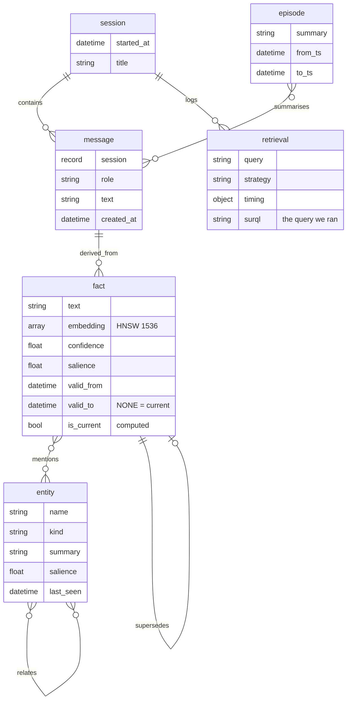
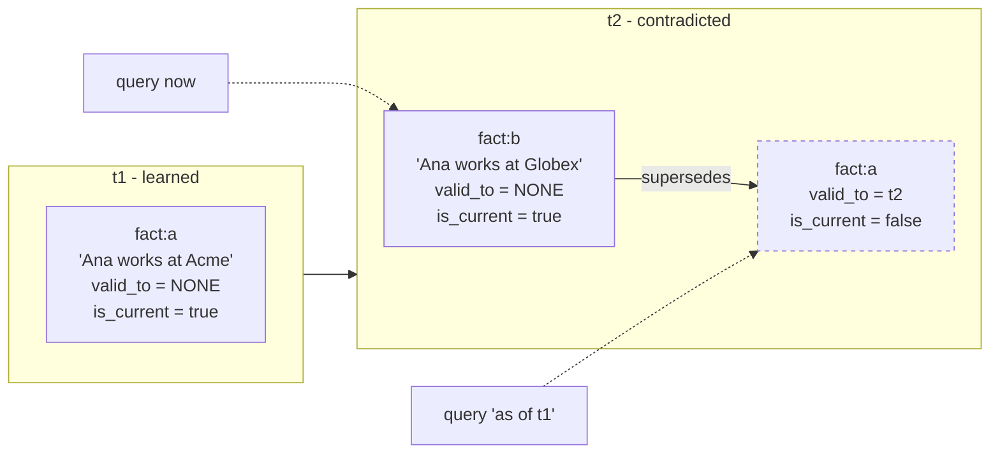

# 03 — Data model

Everything below is written to become `schema.surql` verbatim. It is one file, idempotent, applied
by the migration container at startup.

## Shape



Two node types carry the memory: **`fact`** (an atomic statement, embedded and searchable) and
**`entity`** (a thing facts are about). Everything else is scaffolding — provenance, grouping, and
the conversation itself.

`retrieval` is unusual and deliberate: **every recall is itself a record**, storing the SurrealQL
that ran and how long it took. That is what powers the query inspector in the UI, and it means the
system can answer "what did you look at before you said that?" — not just "what do you know".

## Namespace and database

```surql
DEFINE NAMESPACE IF NOT EXISTS cortex;
USE NS cortex;
DEFINE DATABASE IF NOT EXISTS main;
USE DB main;
```

## Tables

```surql
-- conversation ---------------------------------------------------------------

DEFINE TABLE IF NOT EXISTS session SCHEMAFULL;
DEFINE FIELD IF NOT EXISTS started_at ON session TYPE datetime DEFAULT time::now();
DEFINE FIELD IF NOT EXISTS title      ON session TYPE option<string>;

DEFINE TABLE IF NOT EXISTS message SCHEMAFULL;
DEFINE FIELD IF NOT EXISTS session    ON message TYPE record<session>;
DEFINE FIELD IF NOT EXISTS role       ON message TYPE string
    ASSERT $value IN ["user", "assistant", "system"];
DEFINE FIELD IF NOT EXISTS text       ON message TYPE string;
DEFINE FIELD IF NOT EXISTS created_at ON message TYPE datetime DEFAULT time::now();
DEFINE INDEX IF NOT EXISTS message_session ON message FIELDS session, created_at;

-- memory ---------------------------------------------------------------------

DEFINE TABLE IF NOT EXISTS entity SCHEMAFULL;
DEFINE FIELD IF NOT EXISTS name      ON entity TYPE string;
DEFINE FIELD IF NOT EXISTS kind      ON entity TYPE string
    ASSERT $value IN ["person", "place", "org", "concept", "artifact", "event"];
DEFINE FIELD IF NOT EXISTS summary   ON entity TYPE option<string>;
DEFINE FIELD IF NOT EXISTS salience  ON entity TYPE float DEFAULT 1.0;
DEFINE FIELD IF NOT EXISTS last_seen ON entity TYPE datetime DEFAULT time::now();
DEFINE INDEX IF NOT EXISTS entity_identity ON entity FIELDS name, kind UNIQUE;

DEFINE TABLE IF NOT EXISTS fact SCHEMAFULL;
DEFINE FIELD IF NOT EXISTS text       ON fact TYPE string;
DEFINE FIELD IF NOT EXISTS embedding  ON fact TYPE array<float>;
DEFINE FIELD IF NOT EXISTS confidence ON fact TYPE float DEFAULT 0.5
    ASSERT $value >= 0.0 AND $value <= 1.0;
DEFINE FIELD IF NOT EXISTS salience   ON fact TYPE float DEFAULT 1.0;
DEFINE FIELD IF NOT EXISTS valid_from ON fact TYPE datetime DEFAULT time::now();
DEFINE FIELD IF NOT EXISTS valid_to   ON fact TYPE option<datetime>;
DEFINE FIELD IF NOT EXISTS created_at ON fact TYPE datetime DEFAULT time::now();

-- computed field (3.0): current-ness is derived, never set by the application
DEFINE FIELD IF NOT EXISTS is_current ON fact VALUE valid_to = NONE;

DEFINE TABLE IF NOT EXISTS episode SCHEMAFULL;
DEFINE FIELD IF NOT EXISTS summary ON episode TYPE string;
DEFINE FIELD IF NOT EXISTS from_ts ON episode TYPE datetime;
DEFINE FIELD IF NOT EXISTS to_ts   ON episode TYPE datetime;

-- provenance of recall -------------------------------------------------------

DEFINE TABLE IF NOT EXISTS retrieval SCHEMAFULL;
DEFINE FIELD IF NOT EXISTS session  ON retrieval TYPE record<session>;
DEFINE FIELD IF NOT EXISTS query    ON retrieval TYPE string;
DEFINE FIELD IF NOT EXISTS strategy ON retrieval TYPE string;        -- hybrid | vector | text | graph
DEFINE FIELD IF NOT EXISTS surql    ON retrieval TYPE string;        -- what actually ran
DEFINE FIELD IF NOT EXISTS timing   ON retrieval TYPE object;        -- { total_ms, knn_ms, fts_ms, graph_ms }
DEFINE FIELD IF NOT EXISTS hits     ON retrieval TYPE array<object>; -- [{ fact, score, via }]
DEFINE FIELD IF NOT EXISTS at       ON retrieval TYPE datetime DEFAULT time::now();
```

## Edges

```surql
DEFINE TABLE IF NOT EXISTS mentions     TYPE RELATION IN fact    OUT entity;
DEFINE TABLE IF NOT EXISTS derived_from TYPE RELATION IN fact    OUT message;
DEFINE TABLE IF NOT EXISTS supersedes   TYPE RELATION IN fact    OUT fact;
DEFINE TABLE IF NOT EXISTS summarises   TYPE RELATION IN episode OUT message;

DEFINE TABLE IF NOT EXISTS relates TYPE RELATION IN entity OUT entity;
DEFINE FIELD IF NOT EXISTS predicate ON relates TYPE string;    -- "works_at", "lives_in", ...
DEFINE FIELD IF NOT EXISTS strength  ON relates TYPE float DEFAULT 0.5;
DEFINE FIELD IF NOT EXISTS since     ON relates TYPE datetime DEFAULT time::now();
```

Edges are separate tables holding their own data, and SurrealDB removes an edge table once no
relationships remain — so there is no dangling-reference bookkeeping in application code. Where
3.0's schema-level bidirectional links apply (`relates`, which is symmetric for some predicates),
they keep both directions in sync without a second `RELATE`.

## Indexes

```surql
-- semantic recall - HNSW, concurrent-write capable in 3.0
DEFINE INDEX IF NOT EXISTS fact_hnsw ON fact FIELDS embedding
    HNSW DIMENSION 1536 DIST COSINE EFC 150 M 12;

-- lexical recall - BM25 with highlighting
DEFINE ANALYZER IF NOT EXISTS cortex_text
    TOKENIZERS class
    FILTERS lowercase, ascii, snowball(english);

DEFINE INDEX IF NOT EXISTS fact_fts ON fact FIELDS text
    FULLTEXT ANALYZER cortex_text BM25 HIGHLIGHTS;

-- ordinary lookups
DEFINE INDEX IF NOT EXISTS fact_recency ON fact FIELDS created_at;
DEFINE INDEX IF NOT EXISTS entity_seen  ON entity FIELDS last_seen;
```

> **`DIMENSION 1536` is load-bearing.** It must equal `EMBED_DIM` and the output width of
> `EMBED_MODEL`, forever — `DEFINE INDEX ... HNSW DIMENSION n` is fixed at definition time.
>
> The default stack already satisfies this: `text-embedding-3-small` emits 1536 dimensions natively.
> Nothing to configure.
>
> Upgrading to `text-embedding-3-large` (3072 native) has two paths. Pass `dimensions=1536` and it
> shrinks to fit this index with no schema change and no re-embedding of *future* facts — though
> existing vectors are from a different model and should be regenerated for consistent similarity.
> Or redefine the index at `DIMENSION 3072` and re-embed the whole corpus. Either way it is a
> deliberate migration, never an env-var edit.
>
> The migration asserts `EMBED_DIM` against the index rather than letting a mismatch surface as a
> query-time error on someone's first message.

## Hybrid retrieval — the one query

This is the query the project exists to show. Semantic, lexical and associative recall in one
statement, one transaction, no application-side join.

```surql
-- $q    : embedding of the user's question
-- $text : the raw question, for BM25
-- $k    : how many seeds per strategy

LET $vec = (
    SELECT id, text, confidence,
           vector::similarity::cosine(embedding, $q) AS score,
           "vector" AS via
    FROM fact
    WHERE embedding <|12,64|> $q
      AND valid_to = NONE
);

LET $kw = (
    SELECT id, text, confidence,
           search::score(1) AS score,
           search::highlight("<em>", "</em>", 1) AS snippet,
           "text" AS via
    FROM fact
    WHERE text @1@ $text
      AND valid_to = NONE
    ORDER BY score DESC
    LIMIT $k
);

-- expand outward from the entities those seeds mention, 1..2 hops
LET $seeds   = array::distinct(array::concat($vec.id, $kw.id));
LET $anchors = (SELECT VALUE ->mentions->entity FROM $seeds);

LET $assoc = (
    SELECT id, text, confidence, 0.4 AS score, "graph" AS via
    FROM fact
    WHERE ->mentions->entity CONTAINSANY $anchors.{1..2}->relates->entity
      AND valid_to = NONE
      AND id NOTINSIDE $seeds
    LIMIT $k
);

RETURN { vector: $vec, text: $kw, graph: $assoc, anchors: $anchors };
```

`<|12,64|>` is the KNN operator — 12 neighbours, EF search width 64. `@1@` is the full-text match
operator bound to reference `1`, which `search::score(1)` and `search::highlight(..., 1)` read.

Fusion (reciprocal rank fusion across the three lists) happens in Python. It is ranking policy, not
data access, and keeping it out of SurrealQL makes it unit-testable. The fused result plus the
SurrealQL string above are written to a `retrieval` record — which is what the inspector displays.

### Provenance walk

```surql
-- why do you believe fact:xyz?
SELECT
    text,
    ->derived_from->message.{ text, created_at, role } AS sources,
    ->supersedes->fact.{ text, valid_from, valid_to }  AS replaced
FROM fact:xyz;
```

### Recursive association

```surql
-- everything within 3 hops of Ana
SELECT VALUE entity:ana.{1..3}->relates->entity;
```

## Temporal model — nothing is deleted



Supersession is one transaction:

```surql
BEGIN;
LET $new = (CREATE fact CONTENT { text: $text, embedding: $emb, confidence: $conf });
UPDATE $old SET valid_to = time::now();
RELATE $new->supersedes->$old;
COMMIT;
```

Retrieval filters on `valid_to = NONE`. Time-travel is the same query with
`valid_from <= $t AND (valid_to = NONE OR valid_to > $t)` — which is why the temporal fields exist
even though v1 ships no time slider.

## Decay — ASYNC, off the write path

```surql
DEFINE EVENT IF NOT EXISTS decay_on_retrieval ON TABLE retrieval WHEN $event = "CREATE" THEN ASYNC {
    -- reinforce what was just used
    UPDATE $after.hits.*.fact SET salience = math::min([salience * 1.15, 3.0]);
    -- everything else drifts down
    UPDATE fact SET salience = salience * 0.999
        WHERE id NOTINSIDE $after.hits.*.fact AND salience > 0.05;
};
```

`ASYNC` runs after commit, so decay never delays the write that triggered it. And because the updates
are ordinary writes, the browser sees nodes brighten and fade through the same live feed as
everything else — no extra plumbing.

## What the browser subscribes to

```surql
LIVE SELECT * FROM fact WHERE valid_to = NONE;
LIVE SELECT * FROM entity;
LIVE SELECT * FROM relates;
LIVE SELECT * FROM mentions;
LIVE SELECT * FROM supersedes;
LIVE SELECT DIFF FROM fact;   -- salience/decay churn, as JSON Patch
```

Notes that matter:

- Each `LIVE SELECT` returns a UUID; the client tracks them and unsubscribes on unmount.
- `CREATE`/`UPDATE` push the full record; `DELETE` pushes only the record id.
- `DIFF` mode pushes JSON Patch instead of the whole record — used for high-frequency salience
  updates so decay doesn't ship a 1536-float embedding on every tick.
- Parameters are captured at registration time, and a bare parameter cannot name a table — use
  `type::table($param)`.
- **Signin/signup invalidates live queries on that session.** Token refresh must re-register.

## Verifying this file

Before any application code exists:

```bash
docker run --rm -v "$PWD:/w" surrealdb/surrealdb:v3 \
  import --conn ws://host.docker.internal:8000 --user root --pass root \
  --ns cortex --db main /w/schema.surql
```

Then in Surrealist: create two contradictory facts, run the supersession transaction, and confirm
`is_current` flips without anything being deleted. That is the smallest check that the temporal
model actually works.
