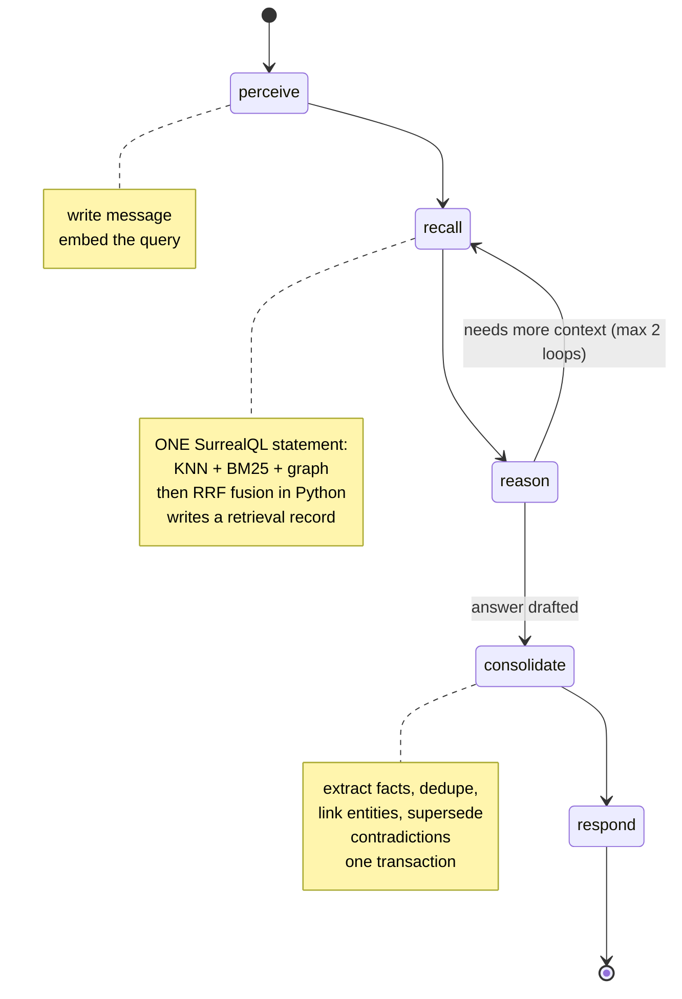
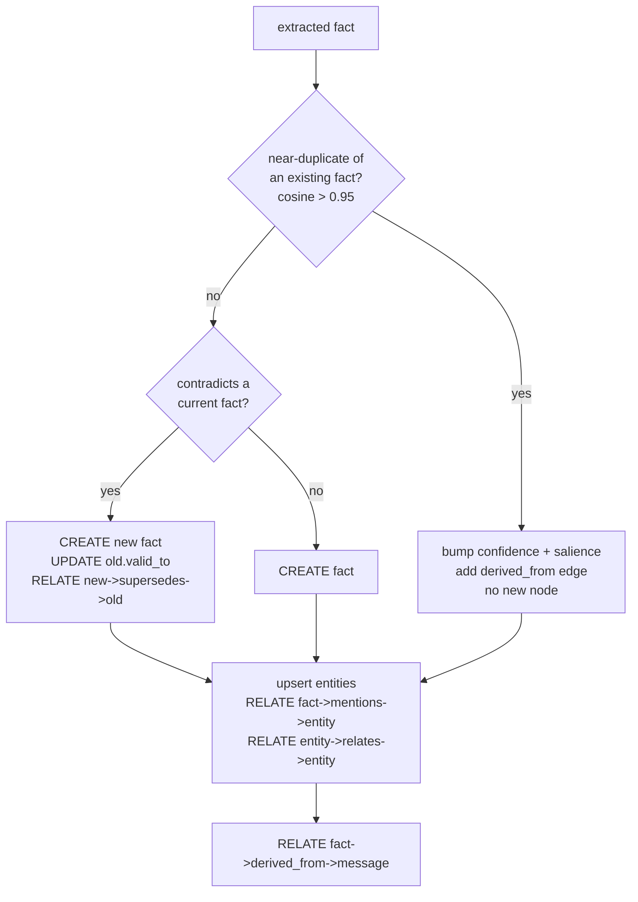

# 04 — Agent

The agent is a LangGraph state machine. It is deliberately small: five nodes on the hot path plus a
background pass. All the interesting behaviour lives in the queries, not in the orchestration.

## Graph



The `reason → recall` loop is capped at two extra passes. It exists because associative recall gets
much better on a second hop once the model knows what it is looking for — but an uncapped loop is
how demos hang.

## State

```python
class CortexState(TypedDict):
    session_id: str
    messages: Annotated[list[AnyMessage], add_messages]
    query_embedding: list[float]
    recalled: list[Hit]          # fused, with `via` provenance per hit
    retrieval_ids: list[str]     # retrieval records written this turn
    extracted: list[Extracted]   # candidate facts from `reason`
    loops: int
```

`Hit` carries `fact_id`, `text`, `score`, and `via` (`vector` / `text` / `graph`). `via` survives all
the way to the UI — it's what decides a glowing node's colour.

## Nodes

### `perceive`
Writes the user turn and prepares for recall.

```surql
CREATE message CONTENT { session: $session, role: "user", text: $text };
```
Then embeds the text. This node is what makes the user's own message appear in the graph feed before
the model has done anything — the first sign of life on screen.

### `recall`
Runs the hybrid query from [03 — Data model](03-data-model.md), fuses the three result lists with
reciprocal rank fusion, and writes a `retrieval` record containing the exact SurrealQL, the timings,
and the hits.

```python
RRF_K = 60
score = sum(1 / (RRF_K + rank) for rank in ranks_across_strategies)
```

Writing the `retrieval` record is not logging — it is a product feature. It drives the inspector
panel, and it triggers the decay event.

### `reason`
The only LLM-heavy node. Prompt carries the recalled facts with their provenance, and asks for two
things in one structured response: the answer, and any new facts worth remembering. Asking for both
together avoids a second round trip and keeps extraction grounded in what was actually said.

Returns `Extracted(text, confidence, entities: list[(name, kind)], relations: list[(subj, pred, obj)])`.

### `consolidate`
The node that does the real work. For each extracted fact, in one transaction:



Dedupe is a KNN query against the new embedding with a high threshold. Contradiction detection is a
narrower LLM call scoped to the handful of current facts that mention the same entities — cheap,
because the graph has already narrowed the candidate set to a few records instead of the whole store.

Entity upsert relies on the `entity_identity` unique index, so concurrent turns cannot create two
`person:ana` records.

### `respond`
Streams the answer to the browser over SSE, writes the assistant `message`, and attaches the
`retrieval` ids so the UI can link an answer to what produced it.

### `decay` (not a node)
Runs inside SurrealDB as an ASYNC table event on `retrieval`. It is not part of the LangGraph graph
at all — deliberately. Reinforcement and forgetting are properties of the memory, not steps in the
agent's reasoning, and putting them in the database means they hold no matter which client writes.

## Tools exposed to the model

The model can call these directly during `reason`. Each maps to one SurrealQL statement.

| Tool | Signature | Query it issues |
|---|---|---|
| `recall_semantic` | `(query: str, k: int = 8)` | `WHERE embedding <\|k,64\|> $q AND valid_to = NONE` |
| `recall_exact` | `(phrase: str, k: int = 8)` | `WHERE text @1@ $phrase ORDER BY search::score(1) DESC` |
| `explore` | `(entity: str, hops: int = 2)` | `entity:x.{1..hops}->relates->entity` |
| `why` | `(fact_id: str)` | provenance walk over `derived_from` + `supersedes` |
| `timeline` | `(entity: str)` | all facts mentioning the entity, current and superseded, ordered by `valid_from` |

`why` and `timeline` are the two that no vector store can offer, and the two that make the demo land:
you can ask the agent to justify itself and it produces the actual source message.

## Checkpointing

LangGraph persistence backed by SurrealDB — a `BaseCheckpointSaver` implementation:

```python
class SurrealCheckpointSaver(BaseCheckpointSaver):
    async def aput(self, config, checkpoint, metadata, new_versions) -> RunnableConfig: ...
    async def aget_tuple(self, config) -> CheckpointTuple | None: ...
    async def alist(self, config, *, filter=None, before=None, limit=None): ...
    async def aput_writes(self, config, writes, task_id) -> None: ...
```

Two tables:

```surql
DEFINE TABLE IF NOT EXISTS checkpoint SCHEMAFULL;
DEFINE FIELD IF NOT EXISTS thread_id     ON checkpoint TYPE string;
DEFINE FIELD IF NOT EXISTS checkpoint_id ON checkpoint TYPE string;
DEFINE FIELD IF NOT EXISTS parent_id     ON checkpoint TYPE option<string>;
DEFINE FIELD IF NOT EXISTS state         ON checkpoint TYPE object;
DEFINE FIELD IF NOT EXISTS metadata      ON checkpoint TYPE object;
DEFINE FIELD IF NOT EXISTS created_at    ON checkpoint TYPE datetime DEFAULT time::now();
DEFINE INDEX IF NOT EXISTS ckpt_thread ON checkpoint FIELDS thread_id, created_at;

DEFINE TABLE IF NOT EXISTS checkpoint_write SCHEMAFULL;
DEFINE FIELD IF NOT EXISTS checkpoint_id ON checkpoint_write TYPE string;
DEFINE FIELD IF NOT EXISTS task_id       ON checkpoint_write TYPE string;
DEFINE FIELD IF NOT EXISTS idx           ON checkpoint_write TYPE int;
DEFINE FIELD IF NOT EXISTS channel       ON checkpoint_write TYPE string;
DEFINE FIELD IF NOT EXISTS value         ON checkpoint_write TYPE any;
```

`parent_id` gives a checkpoint tree rather than a list, which is what LangGraph's time-travel and
branching need — and sets up the stretch-goal time-travel scrubber in
[07 — Roadmap](07-roadmap.md) with no schema change.

**This is worth extracting.** LangGraph users reach for Postgres by default; a SurrealDB checkpointer
published as its own small package is independently useful, and is the kind of contribution a
database team notices.

## Connection handling

```python
from surrealdb import AsyncSurreal

db = AsyncSurreal(os.environ["SURREAL_URL"])   # ws://surrealdb:8000/rpc
await db.connect()
await db.signin({"username": ..., "password": ...})
await db.use(ns="cortex", db="main")
```

One long-lived WebSocket connection held for the process lifetime, wrapped so that a dropped socket
reconnects and re-authenticates. WebSocket rather than HTTP because the agent issues many small
queries per turn and the stateful connection avoids per-request handshakes.

## Models

OpenAI, via `langchain-openai`. **Two chat models, not one** — the agent makes two very different
kinds of call and paying flagship prices for both is waste:

| Call site | Node | Shape of the call | Model |
|---|---|---|---|
| Answer + fact extraction | `reason` | Long context, structured output, quality-sensitive. Once per turn | `LLM_MODEL` — `gpt-5.6-terra` |
| Contradiction / dedupe adjudication | `consolidate` | Tiny prompt, a handful of candidate facts, several times per turn | `LLM_MODEL_FAST` — `gpt-5.6-luna` |

The `consolidate` calls can use the cheap model precisely *because* of the data model: by the time
the model is asked "does this contradict that?", the graph has already narrowed the candidates from
the whole store to the few current facts mentioning the same entities. Retrieval quality buys model
cost. Bump `LLM_MODEL` to `gpt-6-astra` when recording the demo video.

```python
from langchain_openai import ChatOpenAI, OpenAIEmbeddings

llm      = ChatOpenAI(model=os.environ["LLM_MODEL"],      temperature=0.3)
llm_fast = ChatOpenAI(model=os.environ["LLM_MODEL_FAST"], temperature=0.0)
embed    = OpenAIEmbeddings(model=os.environ["EMBED_MODEL"])   # text-embedding-3-small → 1536
```

`OPENAI_API_KEY` and the optional `OPENAI_BASE_URL` are read from the environment by the SDK. Both
model objects are constructed once at startup, not per request.

### Structured output

`reason` returns the answer and the extracted facts in a single response, which only works if the
response shape is guaranteed. Bind a Pydantic schema:

```python
class ReasonOutput(BaseModel):
    answer: str
    extracted: list[Extracted]

reasoner = llm.with_structured_output(ReasonOutput)
```

This uses OpenAI's structured outputs (constrained decoding), so the schema is enforced by the API
rather than by hopeful JSON parsing. That is what makes the one-call design safe — without it, a
malformed extraction would either lose the turn's memory or poison it.

`consolidate`'s contradiction check does the same with a much smaller schema:
`{ contradicts: bool, target_fact_id: str | None, reason: str }`.

### Embeddings

`text-embedding-3-small`, 1536 dimensions natively — matching `HNSW DIMENSION 1536` with no
configuration. See [03 — Data model](03-data-model.md) for what changes if you swap it.

Two call sites, and they have different shapes:

- `recall` embeds one query string per turn. Nothing to optimise.
- `consolidate` may embed several new facts in one turn. **Batch them into a single
  `embed_documents()` call** — one round trip instead of N. Easy to get wrong by embedding inside the
  per-fact loop, and it shows up directly as a slower graph animation.

### Not a lock-in

`OPENAI_BASE_URL` points the same code at any OpenAI-compatible endpoint — Azure OpenAI, LiteLLM,
vLLM, Ollama. The only hard constraint is the one the index imposes: whatever serves `EMBED_MODEL`
must emit vectors of exactly `EMBED_DIM` width. Chat models can be swapped freely as long as they
support structured output.

## Tests worth writing

Not a test suite — the four checks that catch real breakage:

1. **Supersession:** feed two contradictory statements; assert the old fact has `valid_to` set,
   `is_current = false`, and a `supersedes` edge pointing at it — and that it is still retrievable.
2. **Dedupe:** feed the same fact twice, phrased differently; assert one node, higher confidence,
   two `derived_from` edges.
3. **Fusion:** given three fixed result lists, assert RRF ordering. Pure function, no database.
4. **Checkpointer:** round-trip a checkpoint and its writes; assert `aget_tuple` reconstructs state.
