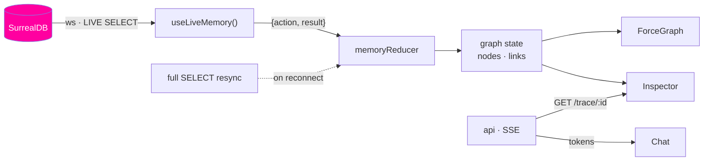
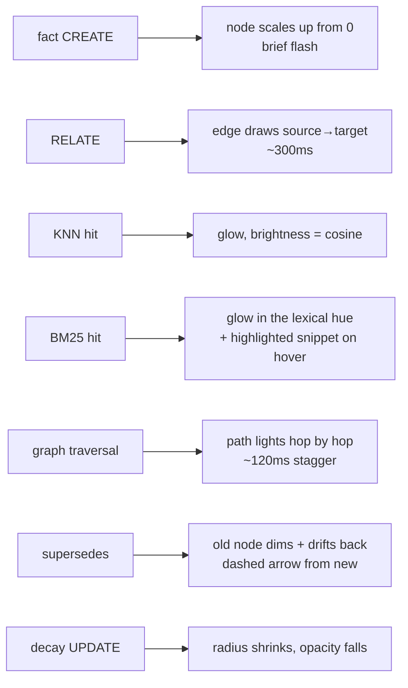

# 05 — UI

The UI is the product. Everything else is infrastructure for making a memory visible.

Design rule for every decision below: **if it doesn't help you see the memory changing, it doesn't
ship.**

## Layout

```
┌──────────────────────────────────────────────────────────────────────────────┐
│  CORTEX                                    ● live    1 database  (vs 5) ▾     │
├──────────────────────────────┬───────────────────────────────────────────────┤
│                              │                                               │
│  you                         │                    ●                          │
│  ▸ Ana moved to Berlin       │                   ╱ ╲                         │
│                              │              ●───●   ●        ← new node      │
│  cortex                      │             ╱     ╲ ╱                         │
│  ▸ Got it — she was at       │        ●───●       ●                          │
│    Acme in Munich before,    │             ╲     ╱                           │
│    so I've updated that.     │              ●···●          ← superseded      │
│    ⓘ 3 recalled · 2 written  │                                               │
│                              │                                               │
│  ┌────────────────────────┐  │                                               │
│  │ ask something…         │  │                                               │
│  └────────────────────────┘  │                                               │
├──────────────────────────────┴───────────────────────────────────────────────┤
│ ▾ inspector · retrieval:8f2a                                    12ms · hybrid │
│   SELECT id, text, vector::similarity::cosine(embedding, $q) AS score         │
│   FROM fact WHERE embedding <|12,64|> $q AND valid_to = NONE                  │
│   ── 3 hits ── fact:k2p (0.89 vector) fact:m1x (0.71 graph) …                 │
└──────────────────────────────────────────────────────────────────────────────┘
```

Chat left, graph right, inspector as a drawer along the bottom. The graph gets the larger share —
it's what people screenshot. On narrow viewports the graph stacks above the chat rather than
disappearing behind a tab; a memory you have to go looking for defeats the purpose.

The header carries two persistent affordances: a **live indicator** (green when the WebSocket is
subscribed, amber while reconnecting, red when resyncing) and the **stack counter** — `1 database`,
expanding on hover into the five it replaces.

## Data path



Two independent streams. The chat can be mid-token while the graph is already three nodes ahead —
that desynchronisation is not a bug, it's the demo.

## The live hook

```ts
// one WebSocket, several subscriptions, one reducer
const LIVE = {
  facts:       "LIVE SELECT * FROM fact WHERE valid_to = NONE",
  entities:    "LIVE SELECT * FROM entity",
  relates:     "LIVE SELECT * FROM relates",
  mentions:    "LIVE SELECT * FROM mentions",
  supersedes:  "LIVE SELECT * FROM supersedes",
  salience:    "LIVE SELECT DIFF FROM fact",
  retrievals:  "LIVE SELECT * FROM retrieval",
} as const;
```

Each returns a UUID. Store them; unsubscribe on unmount.

### Reducer contract

Payloads arrive as `{ action: "CREATE" | "UPDATE" | "DELETE" | "CLOSE", result }`. On `DELETE` the
result is **only a record id**, not the record — the reducer must handle that asymmetry.

```ts
type Node = {
  id: string;
  kind: "fact" | "entity";
  label: string;
  entityKind?: "person" | "place" | "org" | "concept" | "artifact" | "event";
  confidence: number;
  salience: number;
  current: boolean;
  glow?: { via: "vector" | "text" | "graph"; score: number; until: number };
  bornAt: number;         // for the entry animation
};

type Link = {
  id: string;
  source: string;
  target: string;
  kind: "mentions" | "relates" | "supersedes" | "derived_from";
  strength: number;
  drawnAt: number;
};

function memoryReducer(state: GraphState, ev: LiveEvent): GraphState;
```

Rules the reducer must get right:

- **`CREATE` on `fact`/`entity`** → insert with `bornAt = now`, so the renderer can animate entry.
- **`CREATE` on an edge table** → insert a link; if either endpoint isn't in state yet (arrival order
  is best-effort, not guaranteed), park it in a pending buffer and flush when the endpoint arrives.
- **`UPDATE` where `valid_to` became non-null** → set `current = false`. Do **not** remove the node.
- **`DIFF` events** → apply JSON Patch to salience only; ignore patches touching `embedding`.
- **`DELETE`** → the payload is an id; remove the node and every link touching it.
- **`retrieval` CREATE** → set `glow` on each hit for ~2.5s, then let it expire; open the inspector.

### Ordering and reconnects

Live message delivery is **best effort across clients**; order is only guaranteed within a single
client's transaction. So:

- The pending-edge buffer above is required, not defensive.
- On socket drop: exponential backoff, re-register all subscriptions, then run a **full `SELECT`
  resync** and reconcile. Live queries can miss events during a disconnect, and a graph that shows
  stale memory is worse than one that flickers.
- Token refresh must happen ahead of expiry, and **signin invalidates live queries** — so a refresh
  is always followed by re-registration plus resync.

## Visual encoding

| Property | Encodes | Range |
|---|---|---|
| Node size | `salience` | 4–14px, eased |
| Node opacity | `current` and salience | superseded nodes drop to ~25% and desaturate |
| Node colour | `kind` | facts one hue; entities coloured by `entityKind` |
| Node ring | `confidence` | thin ring, thickness scales with confidence |
| Glow colour | recall strategy | vector / text / graph each distinct |
| Glow intensity | score | brightest = best match |
| Link thickness | `strength` | 1–4px |
| Link style | edge kind | `relates` solid, `mentions` thin, `supersedes` dashed with an arrow, `derived_from` faint |

Colour never carries information alone — shape, ring and dash pattern back it up, so the graph stays
readable for colour-blind viewers and in a compressed GIF.

## The seven moments

Each animation exists because it makes a database operation legible.



The hop-by-hop stagger on traversal is the single most important animation in the app: it is the one
thing a vector store structurally cannot do, and staggering makes that visible rather than
instantaneous.

## Query inspector

Opens when a `retrieval` record arrives, or on clicking any glowing node.

- The **exact SurrealQL** that ran, syntax-highlighted, straight from `retrieval.surql` — not a
  reconstruction.
- Timing breakdown from `retrieval.timing`: total, KNN, BM25, graph.
- Each hit with its score and `via`, clickable to focus that node.
- A "copy query" button. Someone evaluating SurrealDB should be able to paste it into Surrealist and
  run it against their own data.

Showing real queries is a deliberate credibility move. Demos that hide their queries get read as
marketing.

## Chat pane

Deliberately plain — it must not compete with the graph. Streamed tokens, and under each assistant
turn a single line: `ⓘ 3 recalled · 2 written`, which opens the inspector for that turn.

One special affordance: clicking any assertion in an answer runs the `why` tool and highlights the
`derived_from` path in the graph, back to the original message. That is the provenance story in one
click.

## States that usually get skipped

| State | Treatment |
|---|---|
| Empty memory | Not a blank canvas — a prompt: "Tell me something about yourself." First message plants the first node, which is the best possible onboarding |
| Loading | Nodes fade in as the initial `SELECT` resolves; no spinner over the canvas |
| Reconnecting | Header goes amber, graph keeps rendering last-known state, banner explains it |
| Resyncing | Brief shimmer as reconciled nodes settle |
| Large graph (>2k nodes) | Fade out nodes below a salience floor and show a count — do not silently truncate |
| Error | Inline in chat with the real error text; memory writes already committed are unaffected |

## Stack

- Next.js App Router, TypeScript.
- `react-force-graph-2d` for the canvas. 2D by default: 3D looks impressive in a still and is worse
  to actually read. A 3D toggle is a stretch goal, not the default.
- SurrealDB JS SDK in the browser for the live connection.
- Tailwind for layout, hand-written CSS for the animations.
- Dark by default. It's a memory graph; glow needs somewhere dark to glow.

## Performance notes

- Force simulation runs at reduced alpha after settle, so new nodes nudge the layout rather than
  re-cooking it and throwing the viewport around.
- Batch live events on an animation frame — a consolidate step can emit a dozen writes in
  milliseconds, and one reducer pass per event will thrash React.
- Never hold `embedding` in client state. It is 1536 floats per fact and the UI never reads it; the
  live projection excludes it.
