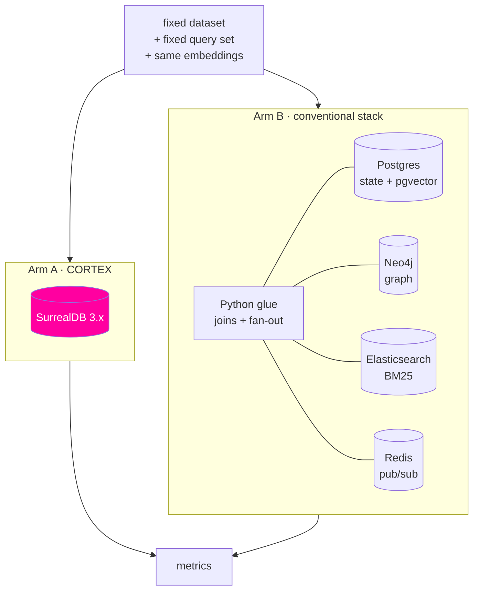

# 06 — Benchmark

This document defines the method. **The result tables are intentionally empty** — they get filled
after implementation, with whatever the numbers turn out to be.

That is not modesty. The claim being tested is SurrealDB's own marketing claim, and a benchmark that
was designed to confirm it is worth nothing. If SurrealDB loses on a metric, that metric is in the
table anyway, with a note on why.

## The question

> For an agent-memory workload, what does consolidating five specialised stores into one engine
> actually cost or save — in latency, in code, in operational surface, and in correctness?

Not "which database is fastest." SurrealDB will not beat a dedicated HNSW library at pure vector
recall, and that is fine. The interesting comparison is at the **workload** level, where the split
stack has to pay for network hops and application-side joins that the single engine does not.

## What is compared



Both arms implement the **same memory semantics** — same schema meaning, same hybrid retrieval, same
RRF fusion, same supersession rules — so the only variable is where the data lives. Arm B is written
the way a competent team would actually write it, not strawmanned: connection pooling, batched
writes, indexes tuned.

Both arms use **identical, pre-computed embeddings** loaded from a file — generated once with
`text-embedding-3-small` (1536d) by the dataset generator, then loaded byte-for-byte into both. No
model is called during measurement. LLM and embedding latency would swamp every difference and are
not the subject; keeping the vectors identical also means the comparison is about storage and
retrieval, never about the embedding provider.

Generating the dataset embeddings is the only OpenAI cost in the benchmark: one pass over 50k short
facts, well under a dollar at `text-embedding-3-small` pricing. It runs once and the vectors are
cached in the repo's data directory, so reruns of `make bench` cost nothing.

## Metrics

| # | Metric | How measured | Why it matters |
|---|---|---|---|
| 1 | Hybrid recall latency, p50 / p95 / p99 | Wall clock around the retrieval step, 1000 queries, after warmup | The user-facing number |
| 2 | Write latency for one consolidate step | Wall clock around the full fact-write transaction | Happens every turn |
| 3 | Round trips per retrieval | Instrumented count | The structural difference, and it explains metric 1 |
| 4 | Lines of data-access code | `cloc` on the data layer only, both arms | The maintenance cost nobody benchmarks |
| 5 | Container count / RSS at idle | `docker stats` after 5min idle | The ops bill |
| 6 | Cold start to first query | Compose up → first successful retrieval | Contributor experience |
| 7 | Cross-store consistency failures | Concurrency test, below | The correctness argument |
| 8 | Recall quality (nDCG@10, recall@10) | Fixed relevance judgements | Guards against winning on speed by retrieving worse |

Metric 8 is the guard rail. Without it, a latency win could just mean the query did less work.

## Consistency test

The one metric where the architectures differ in kind rather than degree.

A writer commits a supersession — new fact, old fact marked `valid_to`, `supersedes` edge — while a
reader continuously issues hybrid retrievals. Count reads that observe a **torn state**: both facts
current, or neither, or an edge pointing at a fact that isn't visible yet.

- Arm A: one transaction. The expected count is zero.
- Arm B: the write spans Postgres, Neo4j and Elasticsearch with no shared transaction. There is a
  window. The test measures how wide.

Run at 1, 10 and 50 concurrent writers.

```
Concurrency | Arm A torn reads | Arm B torn reads | Arm B window (ms) p95
------------|------------------|------------------|----------------------
1           |                  |                  |
10          |                  |                  |
50          |                  |                  |
```

## Dataset

- **Size:** 50k facts over ~5k entities, synthetic but structurally realistic — a social/professional
  graph with job changes, relocations and relationships, so supersession fires naturally.
- **Contradictions:** ~8% of facts supersede an earlier one. This is what makes it a *memory*
  benchmark rather than a retrieval benchmark.
- **Queries:** 1000, split across four kinds, because a single query type flatters one architecture:

| Kind | Share | Example |
|---|---|---|
| Semantic | 40% | "who is into distributed systems?" |
| Lexical | 20% | "invoice 4417-B" |
| Associative | 25% | "who does Ana know at her old company?" |
| Temporal | 15% | "where did Ana work before?" |

- **Relevance judgements** are generated from the synthetic ground truth, not hand-labelled, so
  nDCG is reproducible by anyone who reruns the generator.

Dataset generator and query set live in the repo. `make bench` reproduces everything end to end.

## Environment

Recorded with every result, because a benchmark without an environment is a rumour: CPU, RAM, disk,
Docker version, image digests for both arms, dataset seed, commit SHA. Single machine, all
containers local — no network variance.

Three runs, median reported, variance shown. Warmup discarded. Both arms get the same warmup budget.

## Result tables — to be filled

### Latency

```
Metric                        | CORTEX (SurrealDB) | Conventional stack
------------------------------|--------------------|-------------------
Hybrid recall p50 (ms)        |                    |
Hybrid recall p95 (ms)        |                    |
Hybrid recall p99 (ms)        |                    |
Consolidate write p50 (ms)    |                    |
Round trips per retrieval     |                    |
```

### Footprint

```
Metric                        | CORTEX | Conventional stack
------------------------------|--------|-------------------
Containers                    |   1    |         4-5
Idle RSS (MB)                 |        |
Data-access LOC               |        |
Cold start to first query (s) |        |
```

### Quality

```
Metric        | CORTEX | Conventional stack
--------------|--------|-------------------
nDCG@10       |        |
Recall@10     |        |
```

## Honesty rules

Committed to before any number exists:

1. **Every metric that was measured is published**, including the ones SurrealDB loses.
2. **No tuning asymmetry.** Time spent tuning Arm B is at least equal to Arm A, and is recorded.
3. **No cherry-picked query set.** The published set is the one used, including queries that
   embarrass us.
4. **Reproducible or retracted.** If `make bench` doesn't reproduce a number on another machine
   within variance, the number comes out.
5. **Scope stated plainly.** Single node, single machine, one workload shape. This is not a general
   database benchmark and will not be described as one.

The credibility is the point. A benchmark that survives a skeptical reader from the SurrealDB team —
or a competitor — is worth more than a favourable one that doesn't.
