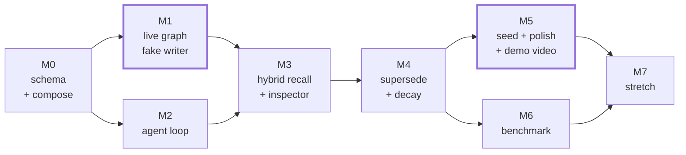

# 07 — Roadmap

Eight milestones. The rule: **every milestone ends with something you can show someone.** No
milestone is "build the backend."

M1 and M5 are bolded because they are the two that decide whether this project gets noticed. M1
proves the core mechanic works at all; M5 is what people actually see.

---

## M0 — Schema and compose

Everything stateful, standing up.

- `schema.surql` from [03 — Data model](03-data-model.md), applied by a one-shot migration container.
- `docker-compose.yml` with `surrealdb`, `migrate`, and healthchecks.
- Viewer user + `/viewer-token` stub.

**Demoable:** `docker compose up`, then open Surrealist and run the hybrid query by hand against a
few seeded records. The queries are real before any application exists.

**Done when:** the supersession check from [03](03-data-model.md#verifying-this-file) passes —
`is_current` flips, nothing is deleted.

---

## M1 — Live graph, fake writer

The riskiest thing in the project, de-risked first: does `LIVE SELECT` → browser → force graph
actually feel alive?

- Next.js app, `react-force-graph-2d`, browser WebSocket to SurrealDB with the viewer token.
- `useLiveMemory` + `memoryReducer` per [05 — UI](05-ui.md), including the pending-edge buffer.
- A Python script that writes facts and edges on a timer. No LLM, no agent.

**Demoable:** run the script, watch the graph build itself. This is the first GIF, and it's already
worth posting.

**Done when:** killing the WebSocket mid-write, reconnecting, and resyncing leaves the graph in a
state matching a fresh `SELECT`. Reconnect correctness now, not later — retrofitting it is misery.

---

## M2 — Agent loop

- FastAPI + LangGraph: `perceive → recall → reason → consolidate → respond`.
- `SurrealCheckpointSaver`.
- Chat pane with SSE streaming.
- Naive recall only (KNN, no fusion) — enough to close the loop.

**Demoable:** a real conversation where memory accumulates and the graph reflects it.

**Done when:** the checkpointer round-trip test passes and a restarted API resumes a thread.

---

## M3 — Hybrid retrieval and the inspector

Where the thesis becomes visible.

- The full one-statement hybrid query; RRF fusion in Python.
- `retrieval` records written every turn with SurrealQL and timings.
- Inspector drawer; glow encoding by `via`; hop-by-hop traversal animation.
- Memory tools (`recall_semantic`, `recall_exact`, `explore`, `why`, `timeline`).

**Demoable:** ask an associative question, watch the traversal light up hop by hop, open the
inspector and read the exact query that did it. **This is the money shot.**

**Done when:** an associative question the vector-only path cannot answer is answered correctly, and
the inspector shows why.

---

## M4 — Supersession and decay

- Contradiction detection in `consolidate`; the supersession transaction.
- Dedupe via high-threshold KNN.
- ASYNC decay event; salience via `LIVE SELECT DIFF`.
- `why` wired to the chat — click an assertion, see the provenance path light up.

**Demoable:** tell it something, contradict it later, watch the old node dim and the new one take
over — then ask *"why did you think that?"* and get the original sentence back.

**Done when:** contradicting a fact never deletes anything, and the timeline query returns both
versions in order.

---

## M5 — Seed, polish, demo

The milestone that decides reach.

- Seeded memory so the graph is interesting on first load.
- All states from [05 — UI](05-ui.md): empty, reconnecting, resyncing, large graph, error.
- Stack counter, live indicator, copy-query button.
- README with an embedded GIF; a 60–90s demo video; three still screenshots.
- One-command quickstart verified on a clean machine.

**Demoable:** the whole thing, to someone who has never seen it.

**Done when:** someone else clones the repo and gets a working demo without asking a question.

---

## M6 — Benchmark

- Dataset generator, query set, relevance judgements.
- Arm B: the conventional stack, built properly.
- `make bench`; results filled into [06 — Benchmark](06-benchmark.md), including the losses.
- Writeup.

**Done when:** `make bench` reproduces on a second machine within stated variance.

---

## M7 — Stretch

Ordered by ratio of impressiveness to risk.

| Idea | What it adds | Risk |
|---|---|---|
| **WASM extension** | Move salience/recency scoring into SurrealQL as a 3.0 WASM extension — scoring runs next to the data, no round trip | Medium. Newest 3.0 feature, thin ground. High payoff: almost nobody has shipped one |
| **Time-travel scrubber** | Scrub the memory to any past moment. Schema already supports it (`valid_from`/`valid_to`, checkpoint `parent_id`) — this is UI work | Low |
| **Fork the mind** | Branch from a past checkpoint, replay with different input, diff the two memory graphs side by side | Medium |
| **MCP server** | Expose CORTEX memory over MCP so any client can use it as its memory layer | Low. Turns a demo into a tool people install |
| **3D toggle** | Optional 3D layout for stills | Low. Cosmetic |

The WASM extension is the one that gets a core engineer's attention. The MCP server is the one that
gets users. Ship both if time allows; ship MCP first if only one.

---

## Sequencing notes

- **M1 before M2.** The live-graph mechanic is the project's only novel risk. If it feels bad,
  everything downstream changes — find out in the first week, not the fourth.
- **M6 can run parallel to M5.** Different work, different failure modes.
- **Reconnect handling lands in M1.** It is the thing everyone defers and nobody retrofits cleanly.
- **No feature ships without its animation.** A memory behaviour you can't see is a behaviour this
  project has no reason to have.
